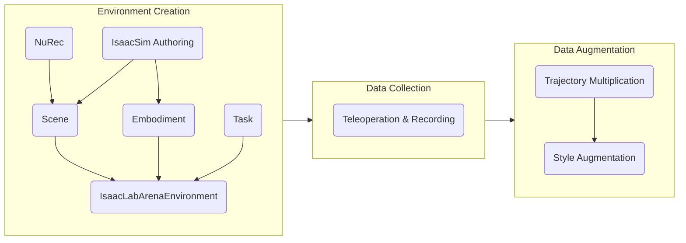

# Hospital Digital Twin

## The Goal

Hospitals are complex, high-stakes environments where robots could assist with repetitive
and physically demanding tasks — ultrasound scanning, surgical instrument handling, patient
monitoring, and more. Building robust robot capabilities for these settings requires large
amounts of high-quality demonstration data collected in simulation before deployment. The
foundation of this approach is a **digital twin**: a simulation that mirrors the
hospital workspace, the robot, and the task, so that data generated in simulation transfers
meaningfully to the real world.

---

## The Pipeline

### Environment Creation

The environment is the digital twin of the hospital workspace. It is composed of three
independent pieces assembled together:

- **Scene** — the physical world: background room, furniture, and physics-enabled objects that can be randomised per episode.
- **Embodiment** — the robot: joints, actuators, action space, observations, and reset behaviour.
- **Task** — the objective: success condition, scene randomisation events, subtask signals for MimicGen, and metrics.

Once defined, they are assembled and compiled into a standard Gymnasium environment that
you can launch interactively to verify everything is in place before collecting data.

### Data Collection

A human operator drives the robot through the task using a teleoperation device —
keyboard, SpaceMouse, gamepad, or XR hand-tracking. Successful episodes are recorded as
HDF5 files containing the action sequence, observations, and initial simulation state.
A small set of demonstrations (10–50) is typically enough to seed the next stage.

### Data Augmentation

1. **MimicGen** takes the recorded trajectories and generates a much larger synthetic dataset by transferring subtask segments to new object configurations — turning 10 human demos
into thousands of training episodes without additional human effort.

## Relevant Technologies

**Isaac Sim** is the physics and rendering engine. You use it to *author* assets — placing
meshes, configuring physics properties, lighting, and exporting USD files. It is the
right tool when you are building or inspecting a scene visually. [IsaacSim documentation](https://docs.isaacsim.omniverse.nvidia.com/6.0.1/index.html)

**IsaacLab** is the robot learning framework built on top of Isaac Sim. It provides
parallelised simulation environments, a manager-based architecture for actions, observations,
events, and terminations, and integrations with imitation learning tools like MimicGen.
You use IsaacLab when you are *training or collecting data*. [IsaacLab documentation](https://isaac-sim.github.io/IsaacLab/)

**IsaacLab Arena** sits on top of IsaacLab and provides a modular composition layer
specifically for hospital automation workflows. It introduces the concepts of **Scene**,
**Embodiment**, and **Task** as composable building blocks, plus utilities for teleoperation,
recording, and data augmentation.  [IsaacLab-Arena documentation](https://isaac-sim.github.io/IsaacLab-Arena/main/)

> A quick rule of thumb: use Isaac Sim to author assets, use IsaacLab/Arena to
> build the robotic application.

**NuRec** is a Real2Sim pipeline that converts real hospital environments into
simulation-ready USD assets by simply taking videos/photos around the environment. [NuRec documentation](./reconstruct_from_video/README.md)

**MimicGen** is a data generation system that takes a small set of human demonstrations
and automatically transfers them to thousands of new object configurations.

**Cosmos-transfer** is a world foundation model used for visual domain randomisation — lighting, textures, camera noise — to make
synthetic datasets more robust for sim-to-real transfer.
