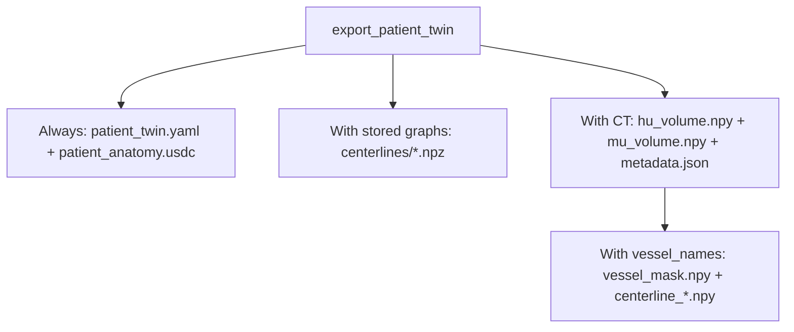

# Patient Digital Twin

Turn a 3D segmentation into named anatomy meshes. Optionally extract vessel or
airway centerlines, attach matching CT, and export USD or an i4h-workflows bundle.


## Install

Python 3.10+, from the repository root:

```bash
pip install -e './patient-digital-twin[pipeline]'
```

The `pipeline` extra supplies USD and skeleton-centerline dependencies for all
examples below. For mesh extraction alone, install `./patient-digital-twin`.

## 1. Load a segmentation and extract meshes

Use a 3D integer NIfTI and its matching label dictionary. This example assumes
background is `0` and aorta is `1`; replace the map with your image's IDs, or pass
a matching JSON file. Every nonzero ID in the image must have a name.

```python
from patient_digital_twin import HumanBody, SegmentationImporter

importer = SegmentationImporter("segmentation.nii.gz", {1: "aorta"})
body = HumanBody(importer.to_anatomy_collection())  # Extracts the surfaces.
aorta = body.anatomy.structures["aorta"]

vertices = aorta.body_vertices  # (N, 3), XYZ meters in the shared body frame.
faces = aorta.faces             # (M, 3), triangle vertex indices.
```

A directory of non-overlapping binary NIfTI masks is also supported:
`SegmentationImporter("masks/")` uses filenames such as `aorta.nii.gz` as names.
No CT or model inference is needed to extract meshes.

## 2. Optionally extract centerlines

Continue with the same `body`:

```python
body.extract_topology(names=["aorta"], spacing_m=0.0015)
graph = aorta.centerline
points, edges, radii = graph.points, graph.edges, graph.radii
```

Points and radii use the mesh's **local meters**; edges index the points.
The explicit spacing selects skeleton extraction without VMTK. Stored graphs
are included when exporting USD or a patient bundle. Skip this step for meshes only.

## 3. Optionally attach CT

Load the matching CT in Hounsfield units. It must share the segmentation's
physical coordinate frame; the affine carries its spacing, orientation, and origin.

```python
import nibabel as nib
import numpy as np

ct = nib.load("ct.nii.gz")
unit = ct.header.get_xyzt_units()[0]
meters_per_unit = {"mm": 0.001, "meter": 1.0, "micron": 1e-6, "unknown": 0.001}[unit]
affine_m = ct.affine.copy()
affine_m[:3] *= meters_per_unit

body.AttachImaging(
    ct.get_fdata(dtype=np.float32).transpose(2, 1, 0),  # XYZ → ZYX array.
    voxel_to_imaging=affine_m,                         # XYZ indices → RAS meters.
    source_path="ct.nii.gz",
)
```

Unspecified NIfTI units are interpreted as millimeters. `source_path` records
provenance; `AttachImaging` receives the volume itself.

## 4. Export

Choose a standalone USD or a bundle with separate arrays:

```python
body.export_to_usd("patient.usdc")
# Or:
manifest = body.export_patient_twin("patient_bundle")
```

Both include stored centerlines and attached CT when present. The bundle directory
must be new. Bundle CT must be axis-aligned after reorientation; resample oblique
CT before export.



For **i4h-workflows navigation**, attach CT and request the vessels explicitly:

```python
manifest = body.export_patient_twin(
    "navigation_bundle", vessel_names=["aorta"], exterior="ct"
)
```

The exporter voxelizes the selected meshes on the CT grid, closes the mask,
keeps its largest component, then calculates navigation centerlines from that
final mask. This works without step 2. Navigation points and radii use **LPS
millimeters**; volumes use **ZYX** order. Per-structure graphs remain separate.
`exterior="ct"` adds a CT-derived patient envelope.

CT attenuation defaults to `linear`: −1000–3000 HU maps to 0–0.02 mm⁻¹, clamped
outside that range. Use `hu_to_mu_preset="interventional"` for the alternative.

## Start from CT or generate a patient

The CLI runs **NV-Segment** on an input image or **NV-Generate** to produce paired
CT and labels. Both are optional; install only the backend you use:

```bash
pip install -e './patient-digital-twin[pipeline,nvsegment]'
# Or:
pip install -e './patient-digital-twin[pipeline,nvgenerate]'
```

These extras install inference dependencies, not model source or weights. Provide
an upstream checkout and its model assets; use a CUDA-compatible PyTorch build.
Inference runs through Python imports in the current process by default. See the upstream
[NV-Segment](https://github.com/NVIDIA-Medtech/NV-Segment-CTMR) and
[NV-Generate](https://github.com/NVIDIA-Medtech/NV-Generate-CTMR) setup guides.

Example: segment the aorta from `s0011/ct.nii.gz` in the
[TotalSegmentator small dataset v201](https://zenodo.org/records/10047263), using
NV-Segment rather than the supplied masks:

```bash
python -m patient_digital_twin \
  --source nvsegment --input /path/to/s0011/ct.nii.gz \
  --bundle-root /path/to/NV-Segment-CTMR/NV-Segment-CTMR \
  --classes aorta --patient-id s0011 \
  --format bundle --output ./output/s0011_aorta

python -m patient_digital_twin \
  --source nvgenerate --source-root /path/to/NV-Generate-CTMR \
  --classes aorta liver --format usd --output ./output/generated.usdc
```

The import API uses the same backends:

```python
from patient_digital_twin import NVSegmentImporter, NVGenerateImporter

anatomy = NVSegmentImporter(
    "ct.nii.gz", bundle_root="/path/to/NV-Segment-CTMR/NV-Segment-CTMR"
).to_anatomy_collection(names=["aorta"])

# Alternative: generate paired anatomy and CT.
generator = NVGenerateImporter(source_root="/path/to/NV-Generate-CTMR")
anatomy = generator.to_anatomy_collection(names=["aorta"])
# Matching CT: generator.ct_volume_zyx and generator.ct_voxel_to_imaging.
```

An explicit `--python /model/env/bin/python` (or `python_executable=` in Python)
opts into a separate process. Use it when dependencies need a different environment
or other application threads depend on the working directory: upstream inference
uses relative paths, so in-process calls temporarily change it and are serialized.

Use new output paths. The CLI extracts missing vessel centerlines automatically.
NV-Segment accepts 3D `.nii`/`.nii.gz`; `--modality MR` supports geometry-only USD.
Bundle output requires CT and at least one vessel. Run
`python -m patient_digital_twin --help` for options.

In an installed i4h-workflows checkout:

```bash
./run.sh endoluminal_navigation --mode validate_fluoroscopy --episodes 1 \
  --patient-twin /path/to/output/s0011_aorta/patient_twin.yaml \
  --record verify.hdf5
```

Add `--headless` when no display is available.

## More detail

- [Package architecture](patient_digital_twin/README.md)
- [USD layout and coordinate transforms](docs/usd.md)
- [Example scripts and viewer](examples/README.md)
- [Standalone CT artifact component](patient_digital_twin/legacy_ct/README.md)
