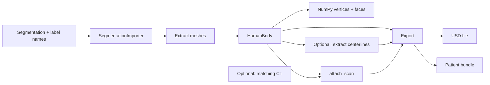
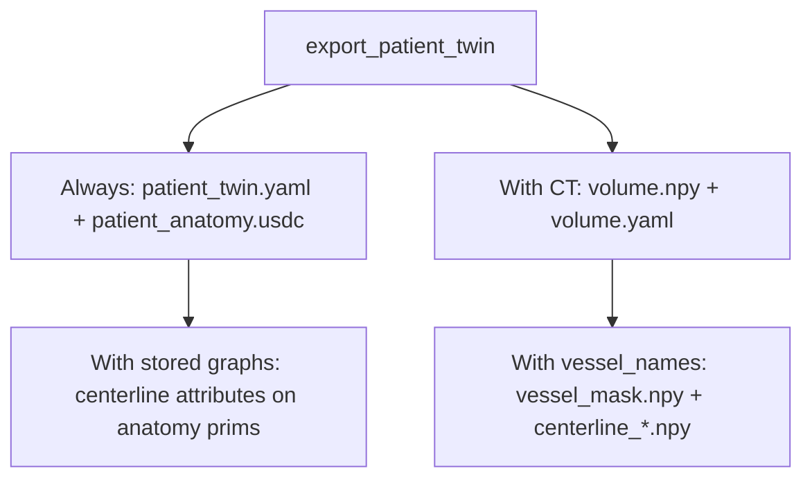

# Patient Digital Twin

Turn a 3D segmentation into named anatomy meshes. Optionally extract vessel or
airway centerlines, attach matching CT, and export USD or an i4h-workflows bundle.



## Install

Python 3.10+, from the repository root:

```bash
pip install -e './patient-digital-twin[pipeline]'
```

The `pipeline` extra supplies USD and skeleton-centerline dependencies for the segmentation and export
examples below. For mesh extraction alone, install `./patient-digital-twin`.

## 1. Load a segmentation and extract meshes

Use the bundled [s0011 CT and masks](examples/data/README.md). Fetch its CT with
Git LFS first (`git lfs pull`). The following Python snippets run in sequence from
the repository root and use new output directories.

```python
from pathlib import Path
from patient_digital_twin import HumanBody, SegmentationImporter

sample = Path("patient-digital-twin/examples/data/s0011")
importer = SegmentationImporter(sample / "segmentations", names=["aorta"])
body = HumanBody(importer.to_anatomy_collection())
aorta = body.anatomy.structures["aorta"]
vertices = aorta.body_vertices  # XYZ meters in the shared body frame.
faces = aorta.faces             # Triangle vertex indices.
```

To hide a mesh without deleting it, set `aorta.enabled = False`; set it to `True`
to restore it. YAML configuration policies are no longer supported.

For a single label volume, pass its matching ID-to-name dictionary instead.
Directory inputs use binary-mask filenames as names; `names` selects masks before
loading them. No model inference is needed to use the supplied s0011 masks.

## 2. Optionally extract centerlines

Continue with the same `body`:

```python
body.extract_topology(names=["aorta"], spacing_m=0.0015)
graph = aorta.centerline
points, edges, radii = graph.points, graph.edges, graph.radii
```

Points and radii use the mesh's **local meters**; edges index the points.
Each mesh is voxelized at that spacing and skeletonized. Stored graphs
are included when exporting USD or a patient bundle. Skip this step for meshes only.

## 3. Optionally attach CT

Load the matching CT in Hounsfield units. It must share the segmentation's
physical coordinate frame; the affine carries its spacing, orientation, and origin.

```python
from patient_digital_twin.scan_volume import from_nifti

body.attach_scan(from_nifti(sample / "ct.nii.gz"))
```

`attach_scan` preserves the source array axes, spacing, orientation, origin, and
units for export, including oblique acquisitions. NIfTI uses its original IJK
array and RAS affine; unspecified spatial units are interpreted as millimeters.
The lower-level `attach_imaging` API accepts KJI arrays with an IJK-to-RAS-meter affine.

## 4. Export

Choose a standalone USD or a bundle with separate arrays:

```python
body.export_to_usd("patient.usdc")
# Or:
manifest = body.export_patient_twin("patient_bundle")
```

Both include stored centerlines and attached CT when present. The bundle directory
must be new. Export does not resample, reorient, or center the source scan.



For **i4h-workflows navigation**, attach CT and request the vessels explicitly:

```python
manifest = body.export_patient_twin(
    "navigation_bundle", vessel_names=["aorta"], ct_exterior=True
)
```

The exporter rasterizes the requested vessel meshes onto the source CT grid, placed
exactly as in the exported USD (including any registration passed to `attach_scan`),
and calculates navigation centerlines from that mask. Skeletonization uses a temporary LPS-ordered
view for consistent results; points are mapped back to the native scan frame.
For label imports this reproduces the
source labels voxel for voxel. It does not close the mask or discard components. This works
without step 2; `ct_exterior=True` adds a CT-derived patient envelope.

Schema-2 bundles preserve **scan array order** for CT and masks. Meshes and
navigation points/radii use the **scan physical frame and units**, declared in
`patient_twin.yaml`; `volume.yaml` records the full array-to-world affine and
source provenance. Read these fields rather than assuming ZYX, LPS, or millimeters.
Navigation centerlines support orthogonal grids, including oblique rotations;
sheared grids require explicit downstream resampling before centerline extraction.
Simulator placement belongs to the consuming workflow. HU → μ conversion belongs
to sensor-simulation, with `linear` (default) and `interventional` presets.

## DICOM and reproducible volume artifacts

Install `./patient-digital-twin[dicom]` to read regular single-frame DICOM CT series.
The CLI accepts a DICOM directory (and `--series-uid` when it contains multiple
series), or an existing `volume.yaml`, in place of the NIfTI input below.
DICOM CLI export keeps the acquisition grid in LPS millimeters and KJI array order.

The small `scan_volume` helper is also shipped in sensor-simulation. Use it
explicitly when a consumer needs a chosen frame, units, axes, or voxel spacing.
This separate example requires your own regular CT series in `dicom/` and the
`dicom` extra; s0011 is supplied as NIfTI:

```python
from patient_digital_twin.scan_volume import Conversion, export_ct, replay

recipe = export_ct("dicom/", "ct_artifact", options=Conversion(
    world_frame="RAS", world_unit="m", origin="dicom", array_axes="kji",
    spacing_ijk_mm=None,  # Preserve spacing; a tuple requests resampling.
))
replay(recipe, "dicom/", "reproduced_ct")
```

This writes `volume.npy` in HU plus one `volume.yaml` containing conversion options,
source file hashes, affines, units, output hash, and implementation versions.
Replay verifies those inputs and versions. Irregular slices and enhanced multi-frame
DICOM require an explicit conversion before using this regular-grid reader.

## Start from CT or generate a patient

The CLI runs **NV-Segment** on an input image or **NV-Generate** to produce paired
CT and labels. Both are optional; install only the backend you use:

```bash
pip install -e './patient-digital-twin[pipeline,nvsegment]'
# Or:
pip install -e './patient-digital-twin[pipeline,nvgenerate]'
```

These extras install inference dependencies, not model source or weights. Provide
an upstream checkout and its model assets; use a CUDA-compatible PyTorch build.
Inference runs through Python imports in the current process by default. See the upstream
[NV-Segment](https://github.com/NVIDIA-Medtech/NV-Segment-CTMR) and
[NV-Generate](https://github.com/NVIDIA-Medtech/NV-Generate-CTMR) setup guides.

Example: segment the aorta from `s0011/ct.nii.gz` in the
[TotalSegmentator small dataset v201](https://zenodo.org/records/10047263), using
NV-Segment rather than the supplied masks:

```bash
python -m patient_digital_twin \
  --source nvsegment --input patient-digital-twin/examples/data/s0011/ct.nii.gz \
  --bundle-root /path/to/NV-Segment-CTMR/NV-Segment-CTMR \
  --classes aorta \
  --format bundle --output ./output/s0011_aorta

python -m patient_digital_twin \
  --source nvgenerate --source-root /path/to/NV-Generate-CTMR \
  --classes aorta liver --format usd --output ./output/generated.usdc
```

The import API uses the same backends (requires the indicated model checkout and weights):

```python
from patient_digital_twin import NVSegmentImporter, NVGenerateImporter

anatomy = NVSegmentImporter(
    sample / "ct.nii.gz", bundle_root="/path/to/NV-Segment-CTMR/NV-Segment-CTMR"
).to_anatomy_collection(names=["aorta"])

# Alternative: generate paired anatomy and CT.
generator = NVGenerateImporter(source_root="/path/to/NV-Generate-CTMR")
anatomy = generator.to_anatomy_collection(names=["aorta"])
# Matching source CT: generator.ct_scan (attach with body.attach_scan).
```

An explicit `--python /model/env/bin/python` (or `python_executable=` in Python)
opts into a separate process. Use it when dependencies need a different environment
or other application threads depend on the working directory: upstream inference
uses relative paths, so in-process calls temporarily change it and are serialized.

Use new output paths. Bundle patient IDs are derived automatically from the input
folder (`geometry` for generated anatomy); no `--patient-id` option is needed.
The CLI extracts missing vessel centerlines automatically.
NV-Segment accepts 3D `.nii`/`.nii.gz`, DICOM CT, or `volume.yaml`;
`--modality MR` supports geometry-only NIfTI USD.
Bundle output requires CT and at least one vessel. Run
`python -m patient_digital_twin --help` for options.

In an installed i4h-workflows checkout:

```bash
./run.sh endoluminal_navigation --mode validate_fluoroscopy --episodes 1 \
  --patient-twin /path/to/output/s0011_aorta/patient_twin.yaml \
  --record verify.hdf5
```

Add `--headless` when no display is available.

## Deprecated: `vasculature_digital_twin`

> **Deprecated.** `vasculature_digital_twin` is kept only so existing users can migrate.
> It will be removed in a future release, receives no new features, and importing it
> emits a `DeprecationWarning` (its `vdt-*` commands emit a `FutureWarning`). Use the
> `patient_digital_twin` APIs above for new work.

| Deprecated capability | Replacement |
| --- | --- |
| `VolumePreprocessor` / `load_nifti_hu` / `load_dicom_series_hu` (reorient CT to LPS) | `scan_volume.from_nifti` / `from_dicom`, which keep native axes, frame, and units |
| `HuToMuMapping`, `hu_to_mu`, `mu_volume.npy` | HU → μ presets in i4h-sensor-simulation |
| `get_vessel_mask` / `vessel_mask_from_totalsegmentator` | `NVSegmentImporter`, or `SegmentationImporter` on existing labels |
| `extract_centerlines` (VMTK), `centerline_points_mm.npy` | `HumanBody.extract_topology`, and `export_patient_twin(vessel_names=...)` for scan-grid `centerline_*.npy` |
| `extract_vessel_mesh` (VTK/Warp) | Structure meshes from any importer; `export_to_usd` / `export_patient_twin` |

It installs with this package. Its optional features (DICOM, TotalSegmentator, VTK/Warp
meshing) are in the `vasculature` extra:

```bash
pip install -e './patient-digital-twin[vasculature]'
```

The package reorients CT into a canonical **LPS** frame (axis 0 toward Superior, axis 1
toward Posterior, axis 2 toward Left) by permuting and flipping axes, never
resampling. It maps Hounsfield Units to linear attenuation (mm⁻¹) with a piecewise-linear
`HuToMuMapping` and caches `mu_volume.npy` + `metadata.json`. It segments vessels by HU
threshold or TotalSegmentator, and extracts centerlines (VMTK) and vessel meshes
(VTK/Warp). This example runs on the bundled s0011 CT:

```python
from vasculature_digital_twin import (  # Emits a DeprecationWarning.
    HuToMuMapping,
    PreprocessingSettings,
    VolumePreprocessor,
    get_vessel_mask,
)

mapping = HuToMuMapping.from_window_level(window_center=100.0, window_width=800.0)
vdt_preprocessor = VolumePreprocessor.from_nifti(
    sample / "ct.nii.gz", settings=PreprocessingSettings(hu_to_mu=mapping)
)
vdt_volume = vdt_preprocessor.preprocess("vasculature_cache")  # mu_volume.npy + metadata.json
vdt_vessels = get_vessel_mask(
    vdt_preprocessor.hu_volume_zyx,
    vdt_volume.spacing_zyx_mm,
    use_totalsegmentator=False,  # True runs TotalSegmentator and adds per-territory masks.
    hu_threshold=200.0,
)
vdt_mask = vdt_vessels.combined_mask  # ZYX uint8 in the canonical LPS frame.
```

The same pipeline is available from the command line:

```bash
vdt-preprocess-ct --nifti /path/to/ct.nii.gz --output-dir /tmp/ct_cache \
  --window-center 100 --window-width 800
vdt-segment-vessels --ct-dir /tmp/ct_cache
```

`vdt-preprocess-ct` also accepts `--dicom <series dir>`, `--control-points=-1000:0,0:0.004,300:0.012`
for a multi-knot curve, and `--no-reorient` to keep stored axes. `vdt-segment-vessels`
writes `vessel_mask.npy`, `centerline_points_mm.npy`, `centerline_edges.npy`, and
`centerline_radii_mm.npy` beside the cache; `metadata.json` records
`anatomical_frame`, `source_orientation`, spacing, origin, and the `hu_to_mu` curve.

Its public API, all importable from `vasculature_digital_twin`:

| Area | Names |
| --- | --- |
| CT loading and frame | `VolumePreprocessor.from_nifti` / `from_dicom` / `from_numpy`, `to_canonical_lps`, `orientation_code`, `affine_to_lps`, `CanonicalVolume`, `CANONICAL_FRAME` |
| HU → μ | `HuToMuMapping` (`from_window_level`, `with_window_level`, `shifted`, `scaled`, `to_dict` / `from_dict`), `PreprocessingSettings`, `hu_to_mu`, `hu_to_mu_curve`, `VolumePreprocessor.with_hu_to_mu` |
| Cache | `PreprocessedVolume` (`save`, `load`, `mu_volume`), `VolumeMetadata` |
| Vessels | `get_vessel_mask`, `vessel_mask_from_hu`, `vessel_mask_from_totalsegmentator`, `VesselSegmentationResult`, `TOTALSEG_VESSEL_TERRITORY_MAP`, `TOTALSEG_CORONARY_LABEL`, `apply_vessel_boost` |
| Centerlines and meshes | `extract_centerlines` (requires VMTK), `CenterlineGraph`, `extract_vessel_mesh` (requires Warp; VTK optional), `ct_coords_to_voxel` |
| Contrast timing | `compute_arrival_map`, `gamma_variate`, `build_contrast_volume` |

## More detail

- [Package architecture](patient_digital_twin/README.md)
- [USD layout and coordinate transforms](docs/usd.md)
- [Example scripts and viewer](examples/README.md)
- [Standalone CT and centerline artifacts](examples/README.md#ct-and-centerline-arrays-only)
- [Deprecated `vasculature_digital_twin`](#deprecated-vasculature_digital_twin)
