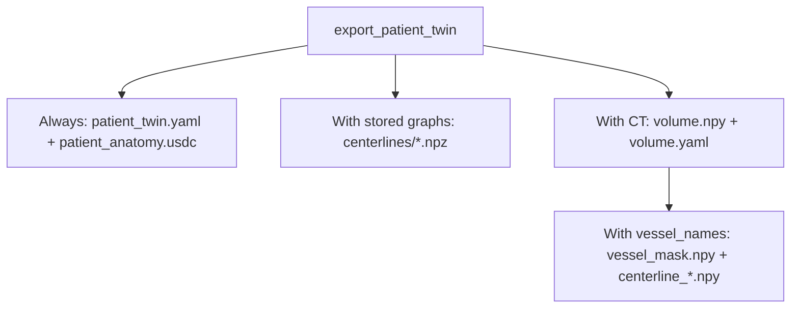

# Patient Digital Twin

Turn a 3D segmentation into named anatomy meshes. Optionally extract vessel or
airway centerlines, attach matching CT, and export USD or an i4h-workflows bundle.


## Install

Python 3.10+, from the repository root:

```bash
pip install -e './patient-digital-twin[pipeline]'
```

The `pipeline` extra supplies USD and skeleton-centerline dependencies for all
examples below. For mesh extraction alone, install `./patient-digital-twin`.

## 1. Load a segmentation and extract meshes

Use a 3D integer NIfTI and its matching label dictionary. This example assumes
background is `0` and aorta is `1`; replace the map with your image's IDs, or pass
a matching JSON file. Every nonzero ID in the image must have a name.

```python
from patient_digital_twin import HumanBody, SegmentationImporter

importer = SegmentationImporter("segmentation.nii.gz", {1: "aorta"})
body = HumanBody(importer.to_anatomy_collection())  # Extracts the surfaces.
aorta = body.anatomy.structures["aorta"]

vertices = aorta.body_vertices  # (N, 3), XYZ meters in the shared body frame.
faces = aorta.faces             # (M, 3), triangle vertex indices.
```

A directory of non-overlapping binary NIfTI masks is also supported:
`SegmentationImporter("masks/")` uses filenames such as `aorta.nii.gz` as names.
No CT or model inference is needed to extract meshes.

## 2. Optionally extract centerlines

Continue with the same `body`:

```python
body.extract_topology(names=["aorta"], spacing_m=0.0015)
graph = aorta.centerline
points, edges, radii = graph.points, graph.edges, graph.radii
```

Points and radii use the mesh's **local meters**; edges index the points.
The explicit spacing selects skeleton extraction without VMTK. Stored graphs
are included when exporting USD or a patient bundle. Skip this step for meshes only.

## 3. Optionally attach CT

Load the matching CT in Hounsfield units. It must share the segmentation's
physical coordinate frame; the affine carries its spacing, orientation, and origin.

```python
from patient_digital_twin.scan_volume import from_nifti

body.AttachScan(from_nifti("ct.nii.gz"))
```

`AttachScan` preserves the source array axes, spacing, orientation, origin, and
units for export, including oblique acquisitions. NIfTI uses its original IJK
array and RAS affine; unspecified spatial units are interpreted as millimeters.
The lower-level `AttachImaging` API still accepts KJI arrays with an IJK-to-RAS-meter affine.

## 4. Export

Choose a standalone USD or a bundle with separate arrays:

```python
body.export_to_usd("patient.usdc")
# Or:
manifest = body.export_patient_twin("patient_bundle")
```

Both include stored centerlines and attached CT when present. The bundle directory
must be new. Export does not resample, reorient, or center the source scan.



For **i4h-workflows navigation**, attach CT and request the vessels explicitly:

```python
manifest = body.export_patient_twin(
    "navigation_bundle", vessel_names=["aorta"], exterior="ct"
)
```

The exporter retains the segmentation labels on the source CT grid and calculates
navigation centerlines from that mask. If only meshes are available, it rasterizes
them on that grid. It does not close the mask or discard components. This works
without step 2; `exterior="ct"` adds a CT-derived patient envelope.

Schema-3 bundles preserve **scan array order** for CT and masks. Meshes and
navigation points/radii use the **scan physical frame and units**, declared in
`patient_twin.yaml`; `volume.yaml` records the full array-to-world affine and
source provenance. Read these fields rather than assuming ZYX, LPS, or millimeters.
Navigation centerlines support orthogonal grids, including oblique rotations;
sheared grids require explicit downstream resampling before centerline extraction.
Simulator placement belongs to the consuming workflow. HU → μ conversion belongs
to sensor-simulation, with `linear` (default) and `interventional` presets.

## DICOM and reproducible volume artifacts

Install `./patient-digital-twin[dicom]` to read regular single-frame DICOM CT series.
The CLI accepts a DICOM directory (and `--series-uid` when it contains multiple
series), or an existing `volume.yaml`, in place of the NIfTI input below.
DICOM CLI export keeps the acquisition grid in LPS millimeters and KJI array order.

The small `scan_volume` helper is also shipped in sensor-simulation. Use it
explicitly when a consumer needs a chosen frame, units, axes, or voxel spacing:

```python
from patient_digital_twin.scan_volume import Conversion, export_ct, replay

recipe = export_ct("dicom/", "ct_artifact", options=Conversion(
    world_frame="RAS", world_unit="m", origin="dicom", array_axes="kji",
    spacing_ijk_mm=None,  # Preserve spacing; a tuple requests resampling.
))
replay(recipe, "dicom/", "reproduced_ct")
```

This writes `volume.npy` in HU plus one `volume.yaml` containing conversion options,
source file hashes, affines, units, output hash, and implementation versions.
Replay verifies those inputs and versions. Irregular slices and enhanced multi-frame
DICOM require an explicit conversion before using this regular-grid reader.

## Start from CT or generate a patient

The CLI runs **NV-Segment** on an input image or **NV-Generate** to produce paired
CT and labels. Both are optional; install only the backend you use:

```bash
pip install -e './patient-digital-twin[pipeline,nvsegment]'
# Or:
pip install -e './patient-digital-twin[pipeline,nvgenerate]'
```

These extras install inference dependencies, not model source or weights. Provide
an upstream checkout and its model assets; use a CUDA-compatible PyTorch build.
Inference runs through Python imports in the current process by default. See the upstream
[NV-Segment](https://github.com/NVIDIA-Medtech/NV-Segment-CTMR) and
[NV-Generate](https://github.com/NVIDIA-Medtech/NV-Generate-CTMR) setup guides.

Example: segment the aorta from `s0011/ct.nii.gz` in the
[TotalSegmentator small dataset v201](https://zenodo.org/records/10047263), using
NV-Segment rather than the supplied masks:

```bash
python -m patient_digital_twin \
  --source nvsegment --input /path/to/s0011/ct.nii.gz \
  --bundle-root /path/to/NV-Segment-CTMR/NV-Segment-CTMR \
  --classes aorta \
  --format bundle --output ./output/s0011_aorta

python -m patient_digital_twin \
  --source nvgenerate --source-root /path/to/NV-Generate-CTMR \
  --classes aorta liver --format usd --output ./output/generated.usdc
```

The import API uses the same backends:

```python
from patient_digital_twin import NVSegmentImporter, NVGenerateImporter

anatomy = NVSegmentImporter(
    "ct.nii.gz", bundle_root="/path/to/NV-Segment-CTMR/NV-Segment-CTMR"
).to_anatomy_collection(names=["aorta"])

# Alternative: generate paired anatomy and CT.
generator = NVGenerateImporter(source_root="/path/to/NV-Generate-CTMR")
anatomy = generator.to_anatomy_collection(names=["aorta"])
# Matching source CT: generator.ct_scan (attach with body.AttachScan).
```

An explicit `--python /model/env/bin/python` (or `python_executable=` in Python)
opts into a separate process. Use it when dependencies need a different environment
or other application threads depend on the working directory: upstream inference
uses relative paths, so in-process calls temporarily change it and are serialized.

Use new output paths. Bundle patient IDs are derived automatically from the input
folder (`geometry` for generated anatomy); no `--patient-id` option is needed.
The CLI extracts missing vessel centerlines automatically.
NV-Segment accepts 3D `.nii`/`.nii.gz`, DICOM CT, or `volume.yaml`;
`--modality MR` supports geometry-only NIfTI USD.
Bundle output requires CT and at least one vessel. Run
`python -m patient_digital_twin --help` for options.

In an installed i4h-workflows checkout:

```bash
./run.sh endoluminal_navigation --mode validate_fluoroscopy --episodes 1 \
  --patient-twin /path/to/output/s0011_aorta/patient_twin.yaml \
  --record verify.hdf5
```

Add `--headless` when no display is available.

## More detail

- [Package architecture](patient_digital_twin/README.md)
- [USD layout and coordinate transforms](docs/usd.md)
- [Example scripts and viewer](examples/README.md)
- [Standalone CT artifact component](patient_digital_twin/legacy_ct/README.md)
