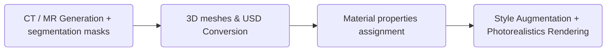

# Patient Digital Twin (Bring your own patient)

For a high-level explanation, class diagram, API guide, and class-by-class
test map, start with the [Python package architecture README](patient_digital_twin/README.md).

## HumanBody and segmentation import

`patient_digital_twin.human.HumanBody` replaces the former `Anatomy` placeholder.
The package exports `HumanBody`, `AnatomicalStructure`, `Kind`, `System`,
the adapters in `patient_digital_twin.importers`,
and `SegmentationImporter`. Importing label metadata does not imply a structure
was observed in an image: an absent structure has `vertices=None`.

From this directory, install the optional integrations:

```bash
uv sync --extra dev --extra soma --extra viewer
```

For pip, install the patient package directly (editable for development):

```bash
pip install -e '.[soma,viewer]'
```

Meshing is bundled as `patient_digital_twin.imaging_to_mesh` and installed by
`pip install .`. It needs no separate distribution, USD runtime, vasculature
package, or source-path configuration. The old `mesh` extra is an empty
compatibility alias.

To use the repository-root virtual environment instead, run from
`/home/mallan/dev/i4h-digital-twin`:

```bash
uv sync --extra dev --extra patient-soma --extra patient-viewer
.venv/bin/python patient-digital-twin/examples/viewer.py --help
```

This installs SOMA-X from PyPI into `i4h-digital-twin/.venv`.
`py-soma-x==0.2.1` is pinned: release 0.3.0 has a broken default asset-loader
import. No sibling SOMA-X source checkout or its virtual environment is used.

SOMA-X requires its model assets (the repository's Git LFS pointer files are
not the assets). Pass a populated asset directory as `data_root`, or let
SOMALayer use its standard Hugging Face cache/download mechanism.

The primary input is an NV-Generate-CTMR/MAISI `*_label.nii.gz` and the
**matching** `configs/label_dict.json` (or `label_dict_ctmr.json`). Never
substitute a current TotalSegmentator ID map: IDs differ between workflows.
The importer consumes existing segmentations; it does not run a generation
model or infer anatomical labels from intensity images.

```python
from patient_digital_twin import SegmentationImporter

importer = SegmentationImporter("sample_label.nii.gz", "/path/to/configs/label_dict.json")
slices = importer.masks_zyx       # one integer 3D NumPy array, indexed Z, Y, X
labelmap = importer.labelmap     # ID -> original source name
body = importer.to_human_body()
liver = body.structures["liver"]
print(liver.vertices, liver.faces)
```

A directory of non-overlapping binary NIfTI masks is also supported. Masks
with different grids/affines or overlaps raise an error. In-memory slices use
`SegmentationImporter.from_array(slices, labelmap, affine_xyz_to_imaging_m=...)`.
Unknown names are retained as `Kind.UNKNOWN`; `strict=True` rejects them.
Background, body envelopes and dummy labels are not internal anatomy meshes.

### Simple API and module organization

`HumanBody` is a small facade: `body.anatomy` owns anatomical systems and
mesh availability; `body.soma` owns SOMA attachment, fitting and articulation.
Existing calls such as `body.attach_soma()`, `body.pose()`,
`body.soma_layer` and `body.check_containment()` remain available.

| Module | Responsibility |
| --- | --- |
| `human.py` | Human-readable patient API |
| `anatomy.py` | `AnatomyCollection` and live `AnatomicalSystem` views |
| `structures.py` | Kinds, rigid structures and retained mesh storage |
| `catalog.py` | Curated kinds, name-based system membership and label imports |
| `configuration.py` | Validated YAML mesh policy |
| `soma_body/` | SOMA representation, output decoding, joint assignment, and fitting |
| `geometry.py` | Shared coordinate transforms and landmark registration |
| `importers/` | Generation, segmentation, and mesh-file imports |

### Empty anatomy and YAML configuration

A structure is empty when disabled or when no mask supplied geometry.
Empty structures retain their name and kind, but
`vertices`, `faces`, `body_vertices` and `world_vertices` return `None`. Check `structure.is_empty`; use
`structure.enabled` to distinguish policy from absent segmentation.

Save a policy like [examples/anatomy.yaml](examples/anatomy.yaml):

```yaml
anatomy:
  enabled: true       # Set false to empty ALL imported anatomy, not the SOMA skin.
  systems:
    skeletal: true
    digestive: false
  structures:
    liver: true       # Explicit exception to the digestive-system setting.
```

```python
body = importer.to_human_body(configuration="examples/anatomy.yaml")
# Or configure an existing body:
body.configure_anatomy("examples/anatomy.yaml")
body.set_anatomy_enabled(False)
body.set_anatomy_enabled(True)  # Restore meshes with previous system/structure rules.
body.set_system_enabled("skeletal", False)
body.set_structure_enabled("liver", False)

digestive = body.system("digestive")  # An AnatomicalSystem live view.
print(digestive.is_empty)
digestive.set_enabled(True)
meshed_structures = body.select(include_empty=False)
```

The master `enabled: false` always wins. Otherwise an explicit structure setting
wins over system settings; a structure belonging to multiple systems is disabled
if **any** of those systems is disabled. Unspecified settings default to enabled.
An enabled structure without a source mask remains empty.

`configure_anatomy()` replaces the policy; `configure_anatomy({})` restores
defaults. Individual setters preserve other settings. Mappings with an
`anatomy` section and `AnatomyConfiguration` objects are also accepted.
Unknown system/structure names, duplicate YAML keys, and non-boolean values are
rejected before changing the body. Structure names use canonical imported names;
load structure-specific policies after importing those labels.

Disabling is reversible, **not a memory-release or import-skipping operation**.
`structure.mesh` retains source geometry, and SOMA fitting and rigid anchor updates continue to include that storage. Re-enabling therefore
restores the current pose even after direct `soma_layer(...)` calls while empty.
Containment checks and the viewer exclude disabled meshes. No bone is deformed
by toggling availability, and the external SOMA skin is independent of this policy.
After changing configuration on a running viewer, call `viewer.refresh()`.
The viewer CLI accepts `--anatomy-config examples/anatomy.yaml`.

### Coordinate contract

All HumanBody geometry uses **XYZ meters**. The input array uses **ZYX
indices**, while `affine_xyz_to_imaging_m` maps XYZ voxel indices to the
original imaging world coordinates. The importer preserves the full NIfTI
affine, including oblique orientation, axis reflection and shear. Header
units are respected; unspecified NIfTI units are interpreted as millimeters.

The importer places the shared body origin at the center of the extracted
anatomy's physical bounding box. Each structure stores centered `vertices`,
triangle `faces`, its imported rigid `local_to_body` placement, and its current
rigid `local_to_world` placement. `HumanBody.body_to_imaging` optionally maps
that shared body frame back to the original imaging world. No structure stores
an imaging transform. Use `structure.body_vertices` for its imported body-frame
surface, `body.imaging_vertices("liver")` for the original scan surface, and
`structure.world_vertices` for its current posed surface. Image voxel
scaling/shear is baked into vertices, never into a rigid transform.

Surface extraction calls the bundled `patient_digital_twin.imaging_to_mesh.mask_to_mesh`
function, without writing intermediate OBJ/USD files.
The importer's file reader is intentionally separate from the converter's
spacing/origin-only loader so the full affine is not lost.

### SOMA alignment and articulation

```python
body.attach_soma(device="cpu", lod="low")
parameters = body.soma_parameters
parameters["poses"][0, list(body.soma_layer.public_joint_names).index("LeftArm") - 1] = 0
body.pose(parameters["poses"])
report = body.check_containment()
```

The alignment, bone-end landmark extraction, similarity fit and limb
refinement are adapted from `SOMA-X/align_segmentation_to_soma.py`. Automatic
fitting needs at least three non-collinear shoulder/hip landmarks. Truncated
bone ends are excluded. A partial scan must supply measured landmarks in
body-frame meters or an explicit rigid `body_to_soma` matrix. A failed
landmark fit is not replaced with an arbitrary bounding-box registration.

Unlike the reference's anatomy rescaling, uniform size fitting changes
SOMA's `global_scale`; the imaging meshes retain their original dimensions.
Pass `identity_coeffs`, `scale_params`, `global_scale` and/or the scan
`poses` to choose a patient-specific SOMA parameterization. Automatic limb
direction/length refinement runs only when no explicit scan pose is supplied.
The residuals in `alignment_errors_m` expose the fit's accuracy.

Anatomy binds to named public SOMA world joint frames. For each structure:

```text
local_to_anchor = inverse(scan_joint_world) @ body_to_soma @ local_to_body
local_to_world  = posed_joint_world @ local_to_anchor
```

These are rigid transforms; the original local vertices are unchanged.
Bones use their corresponding limb joint and central tissues use torso
joints. Override a structure with `anchors={"liver": "Spine2"}` during
attachment. SOMA's public transform array includes its virtual Root, whereas
the pose array excludes it; the implementation maps by joint name.

`body.pose(...)` and direct `body.soma_layer(...)` forward calls synchronize
all meshes. With SOMA's two-phase API, explicitly call
`body.update_from_soma(body.soma_layer.pose(...))`. A HumanBody represents
one patient, so batch sizes other than one are rejected. Reattach when an
identity change requires recalculating the mesh-to-joint offsets.

For a scan that does not fit the mean SOMA identity, call
`body.fit_soma_shape(required_pose_arrays)`. All anatomy is constrained rigidly
in each requested pose.
This fits bounded PCA identity coefficients across the requested poses.
`body.fit_bone_anchors(required_pose_arrays)` then fits fixed rigid bone
offsets, bounded by default to 30 mm per translation axis and 25 degrees of
rotation. It never resizes bones. Both fitting reports expose the adjustments.

All anatomical structures move rigidly. Matching uses temporary name-based
regions and laterality to select joints; these hints are not stored on the
structures. Measured bone landmarks are cleared after successful attachment.
Only the resulting `anchor_joint` and `local_to_anchor` binding are needed to
follow subsequent joint motion. System visibility is looked up by canonical
name in the catalog; custom names can use per-structure visibility settings.

Serialize `body.soma_configuration` to reuse identity, scale, pose, alignment
and the fitted joint offsets. Pass it back as `body.attach_soma(**config)`.

### Viewer and validation

```bash
uv run --extra soma --extra viewer python examples/viewer.py \
  --segmentation sample_label.nii.gz \
  --labels /path/to/NV-Generate-CTMR/configs/label_dict.json \
  --fit-shape --save-parameters patient.json
```

Open `http://127.0.0.1:8080`. Controls select scan/arms-out/seated/bent-torso
poses, change a joint's axis-angle rotation, adjust skin opacity, isolate a
structure and run containment checks. `--parameters patient.json` accepts
JSON arrays for the attachment arguments described above. All numbers use
meters and radians. A subsequent run can use `--parameters patient.json` without rerunning the fit. The server binds to localhost by default. For access from another machine, add
`--host 0.0.0.0` and open `http://<server-ip>:8080` from that machine.

Run the same pose sweep without a browser:

```bash
uv run --extra soma --extra viewer python examples/viewer.py \
  --segmentation sample_label.nii.gz --labels /path/to/configs/label_dict.json \
  --fit-shape --validate-only --report containment.json
```

The validator tests **every mesh vertex and every triangle center**, reports
outside-point counts and maximum protrusion in meters, and exits nonzero
on any failed structure. It requires watertight, consistently wound SOMA
skin. Finite surface-point testing does not prove the absence of every
possible triangle/skin intersection. Installing `embreex` optionally
accelerates the ray queries; it is not required for correctness.

**Validate each new patient and required pose.** Rigid attachment alone does
not guarantee containment. Shape fitting can fail for anatomy outside the
model's representational range, and arbitrary extreme poses are not covered
by four pose tests. Failures are reported without bending or shrinking bones.

The reports under [validation/](validation/README.md) are historical results
from the previous coordinate/deformation API. They are not validation of this
rigid-only implementation. Regenerate fitted parameters and containment reports
for the current API and your patient data.

### Tests

```bash
uv run --extra dev pytest
# Full integration coverage requires the optional dependencies and real assets:
PATIENT_TWIN_TEST_SOMA=1 uv run --extra dev --extra soma --extra viewer pytest
```

Fast tests cover kinds, shared body origins, scan-coordinate recovery, units, oblique/reflected/
sheared affines, closed boundary meshes, invalid masks and truncated
landmarks. Integration tests exercise rigid transforms, direct layer updates,
viewer scene changes and the actual SOMA model over four poses using small
synthetic interior geometry fixtures. Those fixtures validate coordinate
and anchoring behavior; they are not a substitute for full-scan containment.
The integration suite also checks rigid organs, rigid bone fitting and
configuration reload.


The Patient Digital Twin pipeline turns clinical data (imaging, physiological) into simulation-ready 3D assets in Universal Scene Description (USD) format. This lets you build and run healthcare simulations—surgical planning, training, or AI policy evaluation—using anatomically accurate, synthetic patient representations instead of real patient data. The result is reusable, privacy-safe digital twins that integrate into Isaac Sim and downstream rendering or domain-randomization workflows.

## Pipeline Overview

The typical synthetic data generation pipeline flows from medical imaging and segmentation through 3D conversion to photorealistic rendering:



## Available Components

1. **CT / MR Generation + segmentation masks**
    - [Generate imaging data and segmentation masks](./generate_imaging/README.md)

2. **3D meshes & USD Conversion**
    - [Extract NumPy surfaces from segmentation masks](./patient_digital_twin/imaging_to_mesh/README.md)

3. **Material properties assignment**
    - Define textures and material properties on the USD assets (coming soon)

4. **Style Augmentation + Photoreal Rendering**
    - Style augmentation and photorealistic rendering integration (coming soon)

## Vessel and airway topology

```python
centerlines = body.extract_topology()
aorta = body.structures["aorta"].centerline
# aorta.points: (N, 3) local XYZ meters
# aorta.radii: (N,) meters
# aorta.edges: (E, 2) point-index pairs
from patient_digital_twin.geometry import transform_points
world_points = transform_points(aorta.points, body.structures["aorta"].local_to_world)
```

Extraction uses optional VTK/VMTK; install a compatible environment following
[VMTK's installation instructions](https://www.vmtk.org/download/). Importing
`patient_digital_twin` does not import those dependencies. Calling extraction
without them raises an installation error.

`topology.py` follows the existing vasculature centerline workflow and uses
[VMTK's automatic centerline network algorithm](https://github.com/vmtk/vmtk/blob/master/vmtkScripts/vmtkcenterlinesnetwork.py)
to avoid interactive source/target selection. Capped/open tubular surfaces and
disconnected components are processed on copies of the mesh. This is basic
geometric extraction; unsuitable surfaces may fail.

All retained `Kind.VESSEL` and `Kind.AIRWAY` meshes are processed, including disabled
anatomy and the composite portal/splenic vein mask. The catalog trachea is an
`AIRWAY`; manually constructed bronchial meshes should also use `Kind.AIRWAY`.
Lung parenchyma is not an airway. Missing meshes are skipped. Extraction errors
identify the structure, and no results are replaced unless the entire call
succeeds. Replacing a structure's vertices or faces clears its centerline; after
in-place array edits, rerun extraction. Posing only changes the transform, so
stored local centerlines remain aligned with their rigid meshes.

For compatibility with i4h-workflows' voxel skeletonization, use
`body.extract_topology(method="skeleton", shape_zyx=shape,
spacing_zyx_m=spacing, origin_xyz_m=origin)`. This method requires VTK, SciPy and
scikit-image, and samples **closed** meshes on the specified grid. Grid origin
and spacing are in each mesh's local meter frame; the origin is the center of
voxel zero. The original VMTK method remains the default. See
[the s0011 comparison example](examples/i4h_workflows_demo.py) and
[its results](examples/data/i4h_workflows_s0011_independent/comparison.json).

## Export to Isaac Sim / OpenUSD

Install the optional USD runtime (`pip install usd-core`, or install this package
with its `usd` extra; the aggregate package calls it `patient-usd`). After attaching
SOMA and setting the desired pose:

```python
path = body.export_to_usd("patient.usdc", skin_opacity=0.15)
```

This exports the current pose as a standalone, Z-up, meter-scale USD stage:

- `/HumanBody/Exterior/SOMA`: external skin, semi-transparent by default.
- `/HumanBody/Anatomy/<name>`: one independently selectable mesh per structure.
- `/HumanBody/Looks`: embedded materials with distinct structure colors.

Open the file in Isaac Sim. Expand `HumanBody/Anatomy` in the Stage panel to
select individual organs. Toggle visibility on `HumanBody/Exterior` to inspect
internal anatomy without the skin. Disabled structures (including the example's
skull) are present but invisible; structures without geometry are omitted.
The export preserves the current rigid placement of all meshes and converts
SOMA's Y-up frame to Z-up once at the root. No external mesh or texture paths
are required. This is a static geometry snapshot; it does not author an animated
skeleton, physics, or collisions.

Export the bundled example with the same arms-down scan pose as the viewer:

```bash
python patient-digital-twin/examples/export_usd.py --output /tmp/patient.usdc
```

Material authoring uses [USD Preview Surface](https://docs.omniverse.nvidia.com/materials-and-rendering/latest/materials_workflows.html)
and standard OpenUSD mesh visibility, so individual anatomy can be inspected
without merging meshes or removing geometry.

## Export an i4h-workflows patient twin

```python
manifest = body.export_patient_twin(
    "new_patient_bundle",
    ct_path="/path/to/ct.nii.gz",
    patient_id="s0011",
    vessel_names=("aorta", "iliac_artery_left", "iliac_artery_right"),
)
```

The output directory must be new. This creates `patient_twin.yaml` plus all of
its relative artifacts: attenuation and HU volumes, volume metadata, vessel mask,
centerline points/radii/edges, and a USD with individually named anatomy. YAML's
`anatomy` inventory lists each structure's USD prim, kind, enabled state, and
missing meshes. It uses
the interventional HU-to-attenuation curve and default supine world placement
from i4h-workflows. `world_from_patient_m` optionally overrides that rigid placement.

Requires optional `vasculature-digital-twin[io]`, VTK and usd-core, plus the
package's existing SciPy/scikit-image dependencies. The body must retain
`body_to_imaging` in NIfTI RAS meters and enabled meshes for the requested vessels.
No segmentation is run by the exporter. The included example runs NV-Segment
first:

```bash
python patient-digital-twin/examples/export_patient_twin.py \
  --ct ~/dev/data/Totalsegmentator_dataset_small_v201/s0011/ct.nii.gz \
  --bundle-root /path/to/NV-Segment-CTMR/NV-Segment-CTMR \
  --output /tmp/human_body_patient_twin
```

All artifacts use the **original CT placement**, independent of the current
SOMA/display pose. If SOMA is attached, the exporter evaluates its saved scan
registration pose and maps the full exterior into the CT frame. HumanBody
supplies all retained internal meshes, including disabled meshes as invisible
prims. The example attaches SOMA automatically; `--soma-parameters` accepts a
JSON registration configuration for a previously fitted patient.

Use `exterior="soma"` to require SOMA, or `exterior="ct"` to export a CT envelope.
The default `"auto"` uses SOMA when attached and a CT envelope otherwise.
`skin_opacity` controls exterior transparency (default 0.15). The full body is
referenced through `artifacts.anatomy_usd`; geometry is not embedded as YAML arrays.
The fluoroscopy scene adjusts its table to support the SOMA body without moving
the CT, organs, catheter, or C-arm. Anatomy outside the acquired CT field remains
visual geometry; it does not add invented X-ray attenuation.

Use `export_to_usd()` for current posed snapshots and `export_patient_twin()`
for scan-aligned navigation. Oblique scans must first be
resampled onto the patient axes. The selected vessel meshes are independently
voxelized onto the CT grid, closed twice, reduced to the largest component, and
skeletonized for the catheter path.

From the i4h-workflows checkout:

```bash
./run.sh endoluminal_navigation --mode demo --episodes 1 --attempts 1 \
  --patient-twin /tmp/human_body_patient_twin/patient_twin.yaml --record verify.hdf5
```
