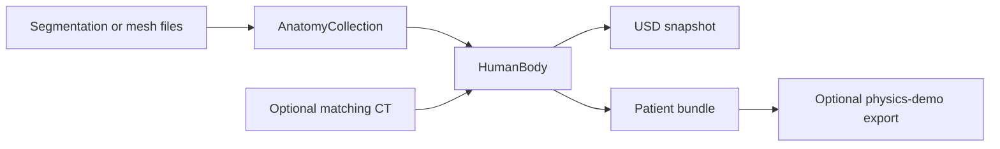

# Patient Digital Twin

Build a patient from **NV-Generate** (`nvgenerate`) or segment a medical image
with **NV-Segment** (`nvsegment`). Select anatomy by name and export either the
existing USD format or an i4h-workflows navigation bundle.

## Run the patient pipeline

From the repository root, install the independently packaged library and its
export/topology dependencies (Python 3.10+):

```bash
uv pip install -e './patient-digital-twin[pipeline]'
# Or: pip install -e './patient-digital-twin[pipeline]'
python -m patient_digital_twin.main --help
```

`patient-digital-twin` is the equivalent installed console command. Use
`--classes aorta iliac_artery_left` or `--classes aorta,iliac_artery_left`.
Names come from `patient_digital_twin.catalog.CATALOG`. Unknown classes,
classes unsupported by the chosen model/modality, and requested classes absent
from its output are errors. Only the requested classes are meshed; NV-Segment
also receives only those class prompts.

```bash
python -m patient_digital_twin.main \
  --source nvsegment --input /path/to/ct.nii.gz \
  --bundle-root /path/to/NV-Segment-CTMR/NV-Segment-CTMR \
  --python /path/to/model-env/bin/python \
  --classes aorta --format workflow --output ./output/patient_aorta

python -m patient_digital_twin.main \
  --source nvgenerate --source-root /path/to/NV-Generate-CTMR \
  --python /path/to/model-env/bin/python \
  --classes aorta liver --format usd --output ./output/generated.usdc
```

`--source`, `--classes`, and `--output` are required. NV-Segment also
requires `--input`: a finite 3D `.nii` or `.nii.gz` medical image with valid
physical spacing/orientation. Convert DICOM to NIfTI before segmentation.
CT intensities must be in Hounsfield units. `--modality MR` supports NV-Segment
with **geometry-only USD**; workflow rendering requires CT. NV-Generate creates
its own paired CT and labels and does not accept `--input`.

Output paths must be new. `--format usd` (default) accepts `.usd`, `.usda`, or
`.usdc` and preserves the existing meter-scale, Z-up USD hierarchy, embedded
CT, and structure-local centerline attributes. `--format workflow` takes a
new directory and writes `patient_twin.yaml` for i4h-workflows'
`endoluminal_navigation` catheter/vasculature workflow. It requires at least one
vessel class and includes:

- `patient_anatomy.usdc`: named meshes and a CT-derived patient envelope.
- `hu_volume.npy`, `mu_volume.npy`, `metadata.json`: canonical LPS, ZYX CT and
  attenuation volume, spacing/origin, and the selected HU-to-attenuation curve.
- `vessel_mask.npy`: vessel union on the CT grid, closed and reduced to its
  largest connected component.
- `centerline_points_mm.npy`, `centerline_edges.npy`, `centerline_radii_mm.npy`:
  navigation graph in LPS millimeters.
- `centerlines/*.npz`: per-structure graphs in local meters, indexed by the manifest.

Missing vessel centerlines are extracted before either export. Existing graphs
are reused with their physical transforms. Skeleton extraction defaults to
`--centerline-spacing-mm 1.5`; VMTK is not required for this pipeline.
Workflow volumes must be axis-aligned after reorientation: resample oblique CT
before running. `--patient-id` sets the manifest identifier. `--hu-to-mu linear`
selects the older linear attenuation curve; the default is `interventional`.

### Model setup

Model inference is optional and runs in a separate interpreter selected by
`--python` (the current interpreter by default). Library installation does not
download weights. For NV-Segment, follow the
[upstream setup](https://github.com/NVIDIA-Medtech/NV-Segment-CTMR), install
`torch`, `monai`, `pytorch-ignite`, `fire`, `einops`, and `huggingface_hub` into
that GPU environment, and make the official checkpoint available at
`<bundle-root>/models/model.pt`:

```bash
git clone https://github.com/NVIDIA-Medtech/NV-Segment-CTMR.git
hf download nvidia/NV-Segment-CTMR vista3d_pretrained_model/model.pt \
  --local-dir ./nvsegment-weights
mkdir -p NV-Segment-CTMR/NV-Segment-CTMR/models
cp nvsegment-weights/vista3d_pretrained_model/model.pt \
  NV-Segment-CTMR/NV-Segment-CTMR/models/model.pt
```

For generation, follow the
[NV-Generate setup](https://github.com/NVIDIA-Medtech/NV-Generate-CTMR) for the
rflow-ct model, paired mask/image checkpoints, and conditioning dataset.
`NV_SEGMENT_CTMR_ROOT` and `NV_GENERATE_ROOT` can replace the corresponding root
arguments. Use a PyTorch build that supports the installed GPU.

### Example: s0011 CT → NV-Segment aorta → navigation

Use `s0011/ct.nii.gz` from the public
[TotalSegmentator small dataset v201](https://zenodo.org/records/10047263).
This is dataset attribution: the example runs **NV-Segment inference on the CT**
and does not use the dataset's supplied segmentation masks.
After downloading/unpacking the dataset and preparing the model above:

```bash
python -m patient_digital_twin.main \
  --source nvsegment \
  --input /path/to/Totalsegmentator_dataset_small_v201/s0011/ct.nii.gz \
  --bundle-root /path/to/NV-Segment-CTMR/NV-Segment-CTMR \
  --python /path/to/model-env/bin/python \
  --classes aorta --patient-id s0011 \
  --format workflow --output /path/to/output/s0011_aorta
```

The executable [s0011 example](examples/nvsegment_s0011.sh) wraps the same command.
The output replaces the old vasculature preprocessing workflow: it includes the
aorta surface, automatically extracted centerline, CT attenuation, patient
placement, and `patient_twin.yaml`. In an installed **i4h-workflows** checkout:

```bash
./run.sh endoluminal_navigation --mode validate_fluoroscopy --episodes 1 \
  --patient-twin /path/to/output/s0011_aorta/patient_twin.yaml \
  --record verify.hdf5
```

Use `--headless` on a machine without a display. This is the current workflow ID
for catheter/vasculature navigation; no intermediate legacy CLI is needed.

### Isolated CT artifact component

`patient_digital_twin.legacy_ct` contains the CT ingest, orientation,
HU-to-attenuation conversion, and mask/centerline artifact writers ported from
the main-branch legacy implementation. It is isolated so it can be removed
or replaced without changing the model importers. It runs without inference:

```bash
python -m patient_digital_twin.legacy_ct \
  --ct /path/to/ct.nii.gz --vessel-mask /path/to/vessel_mask.nii.gz \
  --output ./output/ct_artifacts
```

This command writes the seven volume/mask/graph artifacts above, not USD or a
workflow manifest. Omit the mask to write only CT artifacts. See its
[component README](patient_digital_twin/legacy_ct/README.md) for the API and provenance.

## Python API and supporting examples

For a high-level explanation, class diagram, API guide, and class-by-class
test map, start with the [Python package architecture README](patient_digital_twin/README.md).

For the USD hierarchy, coordinate transforms, embedded CT and centerlines, see
[Working with patient USD files](docs/usd.md). Agent workflows are in the shared
[patient-digital-twin skill](../skills/patient-digital-twin/SKILL.md) and
[patient-usd skill](../skills/patient-usd/SKILL.md).

For a minimal generate → USD → Isaac Sim workflow, see
[`examples/isaac_sim.py`](examples/isaac_sim.py) and the
[example commands](examples/README.md#isaac-sim-viewer).

All importers return an `AnatomyCollection` through `to_anatomy_collection()`.
Wrap imported anatomy with `HumanBody` to attach imaging or export assets:

```python
from patient_digital_twin import HumanBody, SegmentationImporter

anatomy = SegmentationImporter("segmentation.nii.gz", "labels.json").to_anatomy_collection()
body = HumanBody(anatomy)
body.export_to_usd("human_body.usdc")
```

Acquisition coordinates and scan bounds remain on the imported collection;
`HumanBody.imaging` remains `None` until imaging is explicitly attached.

## Optional NumPy imaging

```python
body.AttachImaging(
    volume_zyx,                         # NumPy array; CT values are already HU.
    voxel_to_imaging=voxel_to_ras_m,    # 4×4 XYZ voxel-index → RAS-meter affine.
    body_to_imaging=body_to_ras_m,      # 4×4 rigid body-frame → RAS-meter transform.
    source_path="original_ct.nii.gz",  # Optional provenance; never opened.
    modality="CT",
)
body.export_to_usd("patient.usdc")     # Includes attached CT automatically.
```

`source_path` and `body_to_imaging` are attachment arguments, not `HumanBody`
constructor arguments or properties. Read them through `body.imaging` after
attachment. Omitting `body_to_imaging` uses the imported collection's source
registration; provide an explicit registration for a different image frame.
The voxel affine is required because NumPy does not encode spacing, orientation,
or origin. Arrays and transforms are copied and made read-only. Failed validation
preserves any previous attachment. `body.imaging_vertices(name)` maps the original
anatomy into the attached image's physical frame, independently of display transforms.

Other modalities can be attached with their modality name; the existing imaging
exporters support CT in HU and reject other modalities rather than treating their
intensities as HU. Exporters no longer take `ct_path`; load an image into NumPy
and call `AttachImaging()` first. Geometry-only USD export needs no imaging.

## HumanBody and segmentation import

`patient_digital_twin.human.HumanBody` replaces the former `Anatomy` placeholder.
The package exports `HumanBody`, `AnatomicalStructure`, `Kind`, `System`,
the adapters in `patient_digital_twin.importers`,
and `SegmentationImporter`. Importing label metadata does not imply a structure
was observed in an image: an absent structure has `vertices=None`.

Use Python 3.10 or newer. From the repository root, the patient distribution is
independently installable:

```bash
uv pip install './patient-digital-twin[usd]'
# Or: pip install './patient-digital-twin[usd]'
```

The base package imports segmentations and meshes into NumPy geometry. Choose
extras for the operation you need:

| Operation | Patient-package dependencies | Repository-root extra |
| --- | --- | --- |
| USD read/write | `usd` | `patient-usd` |
| Physics-demo export | `physics`, plus the physics demo source checkout | `patient-physics` |
| Pipeline / skeleton topology | `pipeline` | `patient-pipeline` |

STL/OBJ import additionally uses `trimesh`. Inference adapters require their
backend runtime and model files; installing this package alone does not install
those backends. Isaac Sim viewing uses Isaac Sim's own Python runtime.

From this directory, install USD support for export:

```bash
uv sync --extra dev --extra usd
# Or: pip install -e '.[usd]'
```

Meshing is bundled as `patient_digital_twin.imaging_to_mesh` and installed by
`pip install .`. It needs no separate distribution, USD runtime, vasculature
package, or source-path configuration. The old `mesh` extra is an empty
compatibility alias.

To use the repository-root virtual environment instead, run from
the repository root:

```bash
uv sync --extra dev --extra patient-usd
.venv/bin/python patient-digital-twin/examples/pipeline.py --help
```

The lower-level `SegmentationImporter` input is an NV-Generate-CTMR/MAISI `*_label.nii.gz` and the
**matching** `configs/label_dict.json` (or `label_dict_ctmr.json`). Never
substitute a different model's ID map: IDs differ between workflows.
The importer consumes existing segmentations; it does not run a generation
model or infer anatomical labels from intensity images.

```python
from patient_digital_twin import HumanBody, SegmentationImporter

importer = SegmentationImporter("sample_label.nii.gz", "/path/to/configs/label_dict.json")
slices = importer.masks_zyx       # one integer 3D NumPy array, indexed Z, Y, X
labelmap = importer.labelmap     # ID -> original source name
anatomy = importer.to_anatomy_collection()
body = HumanBody(anatomy)
liver = body.anatomy.structures["liver"]
print(liver.vertices, liver.faces)
```

A directory of non-overlapping binary NIfTI masks is also supported. Masks
with different grids/affines or overlaps raise an error. In-memory slices use
`SegmentationImporter.from_array(slices, labelmap, affine_xyz_to_imaging_m=...)`.
Unknown names are retained as `Kind.UNKNOWN`; `strict=True` rejects them.
Background, body envelopes and dummy labels are not internal anatomy meshes.

### Simple API and module organization

`HumanBody` is a small facade: `body.anatomy` owns anatomical systems and
mesh availability, while `body.imaging` holds optional attached imaging.
HumanBody provides exports, topology extraction, and imaging-frame conversion.

| Module | Responsibility |
| --- | --- |
| `human.py` | Human-readable patient API |
| `anatomy.py` | `AnatomyCollection` and live `AnatomicalSystem` views |
| `structures.py` | Kinds, rigid structures and retained mesh storage |
| `catalog.py` | Curated kinds, name-based system membership and label imports |
| `configuration.py` | Validated YAML mesh policy |
| `geometry.py` | Shared coordinate transforms and landmark registration |
| `imaging.py` | Validated NumPy volume, modality and spatial metadata |
| `exporters/` | USD snapshots, patient bundles, CT utilities and physics-demo exports |
| `importers/` | Generation, segmentation, and mesh-file imports |

### Empty anatomy and YAML configuration

A structure is empty when disabled or when no mask supplied geometry.
Empty structures retain their name and kind, but
`vertices`, `faces`, `body_vertices` and `world_vertices` return `None`. Check `structure.is_empty`; use
`structure.enabled` to distinguish policy from absent segmentation.

Save a policy like [examples/data/nv_ct_high_resolution/anatomy.yaml](examples/data/nv_ct_high_resolution/anatomy.yaml):

```yaml
anatomy:
  enabled: true       # Set false to empty all imported anatomy.
  systems:
    skeletal: true
    digestive: false
  structures:
    liver: true       # Explicit exception to the digestive-system setting.
```

```python
anatomy = importer.to_anatomy_collection(configuration="examples/data/nv_ct_high_resolution/anatomy.yaml")
body = HumanBody(anatomy)
# Or configure an existing body:
body.anatomy.configure("examples/data/nv_ct_high_resolution/anatomy.yaml")
body.anatomy.set_enabled(False)
body.anatomy.set_enabled(True)  # Restore meshes with previous system/structure rules.
body.anatomy.set_system_enabled("skeletal", False)
body.anatomy.set_structure_enabled("liver", False)

digestive = body.anatomy.system("digestive")  # An AnatomicalSystem live view.
print(digestive.is_empty)
digestive.set_enabled(True)
meshed_structures = body.anatomy.select(include_empty=False)
```

The master `enabled: false` always wins. Otherwise an explicit structure setting
wins over system settings; a structure belonging to multiple systems is disabled
if **any** of those systems is disabled. Unspecified settings default to enabled.
An enabled structure without a source mask remains empty.

`body.anatomy.configure()` replaces the policy; `body.anatomy.configure({})` restores
defaults. Individual setters preserve other settings. Mappings with an
`anatomy` section and `AnatomyConfiguration` objects are also accepted.
Unknown system/structure names, duplicate YAML keys, and non-boolean values are
rejected before changing the body. Structure names use canonical imported names;
load structure-specific policies after importing those labels.

Disabling is reversible, **not a memory-release or import-skipping operation**.
`structure.mesh` retains source geometry. Re-enabling restores the current
placement, and toggling availability never changes the stored vertices or faces.

### Coordinate contract

All HumanBody geometry uses **XYZ meters**. The input array uses **ZYX
indices**, while `affine_xyz_to_imaging_m` maps XYZ voxel indices to the
original imaging world coordinates. The importer preserves the full NIfTI
affine, including oblique orientation, axis reflection and shear. Header
units are respected; unspecified NIfTI units are interpreted as millimeters.

The importer places the shared body origin at the center of the extracted
anatomy's physical bounding box. Each structure stores centered `vertices`,
triangle `faces`, its imported rigid `local_to_body` placement, and its current
rigid `local_to_world` placement. `body.imaging.body_to_imaging`, after attachment, maps
that shared body frame back to the original imaging world. No structure stores
an imaging transform. Use `structure.body_vertices` for its imported body-frame
surface, `body.imaging_vertices("liver")` for the original surface in an attached image, and
`structure.world_vertices` for its current posed surface. Image voxel
scaling/shear is baked into vertices, never into a rigid transform.

Surface extraction calls the bundled `patient_digital_twin.imaging_to_mesh.mask_to_mesh`
function, without writing intermediate OBJ/USD files.
The importer's file reader is intentionally separate from the converter's
spacing/origin-only loader so the full affine is not lost.

### Tests

```bash
uv run --extra dev pytest
```

Tests cover kinds, shared body origins, scan-coordinate recovery, units,
oblique/reflected/sheared affines, closed boundary meshes, invalid masks,
configuration, and rigid transforms. Optional integration tests exercise USD,
CT, topology, and physics-demo exports when their dependencies are installed.

## Import and export pipeline

The public entry point is [main.py](patient_digital_twin/main.py), described above.
For lower-level segmentation/mesh examples,
[examples/pipeline.py](examples/pipeline.py) imports anatomy, attaches matching CT
when available, extracts topology, and writes a patient
bundle plus a standalone USD. See the [source-specific commands](examples/README.md).
The pipeline does not anonymize input data or establish anatomical accuracy.



## Vessel and airway topology

```python
centerlines = body.extract_topology()
aorta = body.anatomy.structures["aorta"].centerline
# aorta.points: (N, 3) local XYZ meters
# aorta.radii: (N,) meters
# aorta.edges: (E, 2) point-index pairs
from patient_digital_twin.geometry import transform_points
world_points = transform_points(aorta.points, body.anatomy.structures["aorta"].local_to_world)
```

Extraction uses optional VTK/VMTK; install a compatible environment following
[VMTK's installation instructions](https://www.vmtk.org/download/). Importing
`patient_digital_twin` does not import those dependencies. Calling extraction
without them raises an installation error.

`topology.py` follows the existing vasculature centerline workflow and uses
[VMTK's automatic centerline network algorithm](https://github.com/vmtk/vmtk/blob/master/vmtkScripts/vmtkcenterlinesnetwork.py)
to avoid interactive source/target selection. Capped/open tubular surfaces and
disconnected components are processed on copies of the mesh. This is basic
geometric extraction; unsuitable surfaces may fail.

All retained `Kind.VESSEL` and `Kind.AIRWAY` meshes are processed, including disabled
anatomy and the composite portal/splenic vein mask. The catalog trachea is an
`AIRWAY`; manually constructed bronchial meshes should also use `Kind.AIRWAY`.
Lung parenchyma is not an airway. Missing meshes are skipped. Extraction errors
identify the structure, and no results are replaced unless the entire call
succeeds. Replacing a structure's vertices or faces clears its centerline; after
in-place array edits, rerun extraction. Posing only changes the transform, so
stored local centerlines remain aligned with their rigid meshes.

For compatibility with i4h-workflows' voxel skeletonization, use
`body.extract_topology(method="skeleton", shape_zyx=shape,
spacing_zyx_m=spacing, origin_xyz_m=origin)`. This method requires VTK, SciPy and
scikit-image, and samples **closed** meshes on the specified grid. Grid origin
and spacing are in each mesh's local meter frame; the origin is the center of
voxel zero. The original VMTK method remains the default when no method or spacing is given.
For automatic per-mesh grids, use `body.extract_topology(spacing_m=0.0015)`;
this selects skeleton extraction and is the pipeline's default approach. See
[the unified pipeline](examples/README.md) for per-structure centerline exports.

## Export to Isaac Sim / OpenUSD

With the `usd` extra installed, export geometry with optional attached CT:

```python
body.export_to_usd("patient.usdc")
```

This produces a static, meter-scale, Z-up stage using current structure transforms
and an identity root. Export does not change the live body's transforms or visibility.

Retained meshes remain separately selectable under `/HumanBody/Anatomy`.
Disabled meshes are invisible; absent meshes are omitted. Attached CT and
extracted centerlines become custom attributes. These attributes do not render a volume or create physics.
See the [USD guide](docs/usd.md) for inspection code, transforms and Isaac Sim use.

## Export a patient bundle

```python
manifest = body.export_patient_twin("new_patient_bundle", patient_id="patient_001")
```

The output directory must be new. `patient_twin.yaml` indexes the anatomy USD,
missing meshes, optional CT/attenuation arrays and already-extracted per-structure
centerlines. CT is optional. Registered anatomy uses `DICOM_LPS`;
unregistered mesh-only anatomy uses `body`. Resolve artifact paths relative to
the manifest, and use its `world_from_patient_m` transform for downstream world
placement. The anatomy USD itself remains in the manifest's patient frame.

`exterior="auto"` omits an exterior. Use `exterior="ct"` to explicitly request
an envelope from attached CT. `skin_opacity` defaults to 0.15. Bundle export
rejects oblique CT: resample the matching inputs onto patient axes before export.

For a navigation bundle, attach matching CT and explicitly request vessels:

```python
manifest = body.export_patient_twin(
    "new_navigation_bundle",
    vessel_names=("aorta", "iliac_artery_left", "iliac_artery_right"),
)
```

Only attached CT plus nonempty `vessel_names` produces the composite vessel mask
and navigation centerline. Requested vessels must have enabled meshes. Their
original scan-frame surfaces are voxelized on the CT grid, closed, reduced to the
largest component. Stored centerlines are reused; when missing, the composite
mask is skeletonized. This requires VTK in addition to SciPy and
usd-core. Geometry-only bundles do not supply a fluoroscopy/navigation volume;
check the consuming application's required artifacts before using them.

Exporter functions are also available from `patient_digital_twin.exporters`:
`export_to_usd`, `export_patient_twin`, and `export_physics_examples`.
The [USD guide](docs/usd.md#physics-demo-exports) covers physics exports, their
additional dependencies, and recorded scene transforms.
