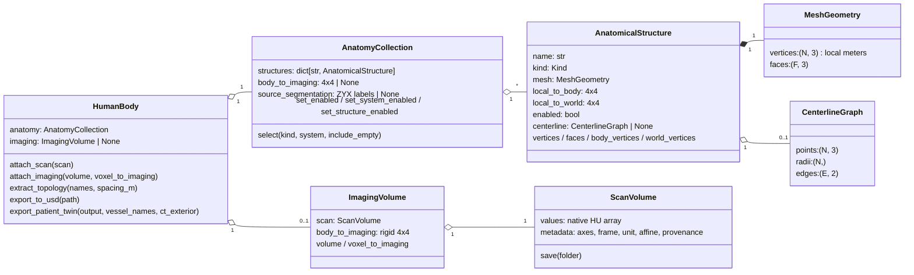
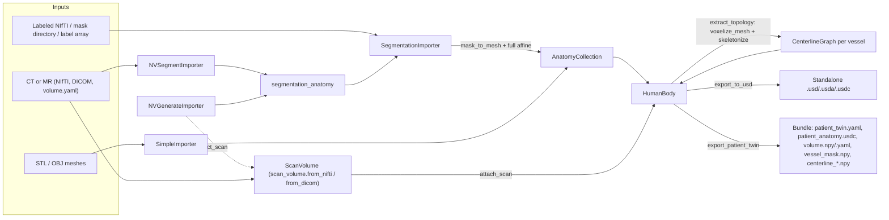

# Patient Digital Twin architecture

`patient_digital_twin` turns medical imaging into named anatomy meshes, optional
vessel centerlines, and exports for simulation. This page explains the key classes,
which module owns each one, and how data flows between them. For a runnable
walkthrough see the [quickstart](../README.md); for the exported USD layout see the
[USD guide](usd.md).

## Modules

| Module | Owns | Depends on |
| --- | --- | --- |
| [`anatomy.py`](../patient_digital_twin/anatomy.py) | `Kind`, `System`, `CATALOG`, `canonical_name`, `MeshGeometry`, `AnatomicalStructure`, `AnatomyCollection` | `geometry` |
| [`body.py`](../patient_digital_twin/body.py) | `HumanBody`, `ImagingVolume` | `anatomy`, `geometry`, `scan_volume` (and `export` on demand) |
| [`importers.py`](../patient_digital_twin/importers.py) | `SegmentationImporter`, `NVSegmentImporter`, `NVGenerateImporter`, `SimpleImporter` | `anatomy`, `geometry`, `scan_volume` |
| [`geometry.py`](../patient_digital_twin/geometry.py) | `CenterlineGraph`, transforms, `mask_to_mesh`, `voxelize_mesh`, centerline extraction | NumPy, scikit-image, SciPy, VTK (lazy) |
| [`export.py`](../patient_digital_twin/export.py) | `export_to_usd`, `export_patient_twin`, `write_artifacts` | `geometry`, OpenUSD (lazy) |
| [`scan_volume.py`](../patient_digital_twin/scan_volume.py) | `ScanVolume`, `Conversion`, NIfTI/DICOM readers, `export_ct`, `replay` | NumPy, PyYAML, nibabel/SimpleITK (lazy) |
| [`__main__.py`](../patient_digital_twin/__main__.py) | `run_pipeline`, the `python -m patient_digital_twin` CLI | `importers`, `body`, `scan_volume` |

`scan_volume.py` is shared byte-for-byte with sensor-simulation and is not edited here.
The separate, deprecated `vasculature_digital_twin` package ships in the same distribution
for migration only; nothing in `patient_digital_twin` imports it. See the
[README section](../README.md#deprecated-vasculature_digital_twin) for its API and replacements.
Heavy optional dependencies (OpenUSD, VTK, MONAI/PyTorch, SimpleITK, trimesh) are imported
only inside the functions that need them, so `import patient_digital_twin` stays light.

## Key classes

- **`AnatomicalStructure`** is one organ, vessel, bone, or other labeled structure. Its
  mesh is stored in a *local* frame centered on the structure, in meters.
  `local_to_body` is where the importer placed it in the shared body frame;
  `local_to_world` is its current pose, which applications may change. Setting
  `enabled = False` hides the public `vertices`/`faces` without deleting `mesh`.
- **`AnatomyCollection`** owns structures by canonical name and remembers where they came
  from: `body_to_imaging` (body frame to the source image's RAS meters) and, for label
  imports, the source label volume used later to build vessel masks on the CT grid.
  The `CATALOG` assigns each canonical name a `Kind` and its `System` memberships,
  which drive `select` and `set_system_enabled`.
- **`HumanBody`** is the object applications use. It holds the anatomy and, once CT is
  attached, an `ImagingVolume` (a native `ScanVolume` plus the rigid registration).
  It computes centerlines and delegates writing to `export.py`.
- **Importers** are constructed with their inputs and expose a single
  `to_anatomy_collection()` method; they do not hold on to the result.

## Data flow

1. **Import.** `SegmentationImporter` meshes each present label with marching cubes in
   voxel coordinates, applies the image's full voxel-to-world affine (orientation, shear,
   reflection, and units), centers each mesh in a local frame, and records a rigid
   `body_to_imaging`. The NV importers run their model, then hand the label NIfTI to
   `segmentation_anatomy`, which uses the same path. `SimpleImporter` loads meshes as-is.
2. **Attach CT (optional).** `attach_scan` keeps the scan's native array order, frame
   (RAS or LPS), and units; no resampling happens anywhere in the package.
3. **Topology (optional).** `extract_topology` voxelizes each vessel/airway mesh on a
   grid in its local frame and skeletonizes it, storing a `CenterlineGraph` on the
   structure.
4. **Export.** `export_to_usd` writes the current pose plus embedded HU. `export_patient_twin`
   writes anatomy in the scan's physical frame and, for `vessel_names`, rasterizes those
   vessels on the CT grid (from the retained source labels, or by voxelizing meshes) and
   writes navigation centerline arrays in scan units.

The CLI (`__main__.run_pipeline`) chains these steps for NV-Segment and NV-Generate:
import only the requested classes, attach the CT, extract missing vessel centerlines,
then export USD or a bundle.

## Coordinate frames

| Frame | Used by | Units |
| --- | --- | --- |
| Structure local | `mesh.vertices`, `centerline` | meters |
| Body | `body_vertices` (via `local_to_body`) | meters |
| World (display pose) | `world_vertices` (via `local_to_world`) | meters |
| Imaging RAS | `body_to_imaging`, `ImagingVolume.voxel_to_imaging` | meters |
| Scan | `ScanVolume.ijk_to_world`, bundle geometry and arrays | the scan's declared unit (RAS or LPS) |

Grids and masks are indexed ZYX (KJI); points are XYZ row vectors.
