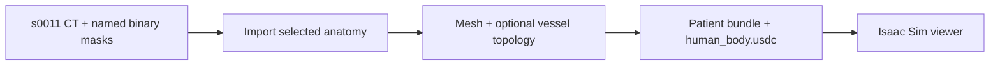

# Patient examples

Run these commands from `patient-digital-twin/` with Python 3.10+:

```bash
pip install -e '.[pipeline]'
git lfs pull
python examples/pipeline.py --source sample --anatomy aorta --output /tmp/s0011-patient
```

The default sample is the supplied s0011 aorta mask and matching CT. Other named
masks can be selected with `--anatomy aorta liver`. The [dataset README](data/README.md)
records its source and license. Every output directory must be new.



The pipeline writes `patient_twin.yaml`, `patient_anatomy.usdc`, and a standalone
`human_body.usdc`. CT remains native HU in `volume.npy` + `volume.yaml` and is also
embedded in the standalone USD. Stored centerlines are attributes on each anatomy
prim, in the stage's units. Simulator placement and attenuation mapping happen
downstream.

`pipeline.py` also accepts `segmentation` (with `--input`, `--labels`, and matching
`--ct`) and `simple` (a mesh-map JSON). For NV-Segment or NV-Generate inference,
use `python -m patient_digital_twin` instead.
STL/OBJ vertices use meters; optional `mesh_to_body` transforms place local meshes.
Omitted transforms are identity. Install `trimesh` for STL/OBJ imports.
See `python examples/pipeline.py --help` for all arguments and the
[optional model setup](../README.md#start-from-ct-or-generate-a-patient).

## Isaac Sim viewer

Export the supplied aorta and liver with matching CT, then open the stage using
an installed Isaac Sim Python runtime:

```bash
python examples/isaac_sim.py export /tmp/s0011.usdc --anatomy aorta liver --with-ct
/path/to/isaac-sim/python.sh examples/isaac_sim.py view /tmp/s0011.usdc
```

The viewer frames anatomy using the stage's spatial units and adds session-only
lighting and a camera. It renders until closed. CT attributes store data; they do
not display a CT volume. Omit `--with-ct` for a smaller anatomy-only USD.

For a bounded headless check and a rendered PNG (requires Pillow in that runtime):

```bash
/path/to/isaac-sim/python.sh examples/isaac_sim.py view /tmp/s0011.usdc \
  --headless --frames 20 --screenshot /tmp/s0011.png
```

## CT and centerline arrays only

```python
from patient_digital_twin.export import write_artifacts
from patient_digital_twin.scan_volume import from_nifti

ct = from_nifti("examples/data/s0011/ct.nii.gz")
aorta = from_nifti("examples/data/s0011/segmentations/aorta.nii.gz")
write_artifacts(ct, "/tmp/s0011-arrays", vessel_mask=aorta.values)
```

This writes native `volume.npy` + `volume.yaml`, `vessel_mask.npy`, and
`centerline_points.npy`, `centerline_edges.npy`, `centerline_radii.npy`.
The mask must share the CT grid. Points/radii use the scan frame and units.
Omit `vessel_mask` for CT-only output.
For a navigation bundle with USD, use
`body.export_patient_twin(..., vessel_names=["aorta"])` as shown in the
[main guide](../README.md#4-export).
