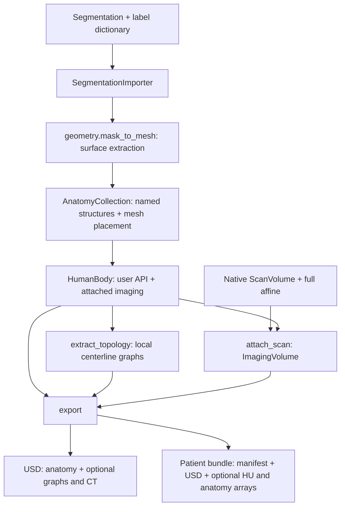

# patient_digital_twin

The Python library behind Patient Digital Twin. Start with the
[quickstart](../README.md) to load a segmentation, extract meshes, optionally add
centerlines and CT, and export the result. The
[architecture guide](../docs/architecture.md) explains the key classes, module
dependencies, data flow, and coordinate frames.

## How the library fits together

## Main entry points

The package is eight modules (see the [architecture guide](../docs/architecture.md)):

- [anatomy.py](anatomy.py): the structures inside the body: the curated catalog
  (`Kind`, `System`, `CATALOG`, `canonical_name`), `AnatomicalStructure`, and
  `AnatomyCollection` (`structures[name]`, `select()`, visibility controls). Disabling
  a structure preserves its mesh.
- [body.py](body.py): `HumanBody`, which owns `anatomy` and optional `imaging`
  (`ImagingVolume`) and exposes `extract_topology()`, `attach_scan()`,
  `attach_imaging()`, `export_to_usd()`, and `export_patient_twin()`.
- [importers.py](importers.py): `SegmentationImporter` (labeled NIfTI, binary-mask
  directories, or NumPy label arrays), `NVSegmentImporter`, `NVGenerateImporter`, and
  `SimpleImporter` (STL/OBJ). Model dependencies load only when inference is requested;
  source checkouts and weights are separate. Inference runs in-process unless an
  explicit `python_executable` is provided.
- [geometry.py](geometry.py): transforms, mask-to-mesh surfaces, voxelization, and
  skeleton centerlines for meshes and native scan masks.
- [export.py](export.py): standalone USD, schema-2 patient bundles, and
  `write_artifacts()` for native volume/mask/graph arrays.
- [__main__.py](__main__.py): the NV-Segment / NV-Generate CLI.
- [scan_volume.py](scan_volume.py): reads native NIfTI/DICOM grids and saves or replays
  NumPy + YAML artifacts. The same helper is shipped in sensor-simulation.

## Coordinates and outputs

Meshes and stored structure centerlines use XYZ meters. `structure.mesh.vertices`
uses the local frame; `structure.body_vertices` includes the original body
placement. `structure.world_vertices` includes the current display placement.

`attach_scan()` retains native values and geometry for export; `attach_imaging()`
remains a lower-level KJI/RAS-meter API. With CT, schema-2 USD and bundle geometry
use the scan physical frame and units. CT and masks preserve source array order.
Simulator world placement is applied downstream.

With attached CT and `vessel_names`, bundle export calculates a navigation graph
by rasterizing the registered vessel meshes onto the CT grid.
See the [export steps](../README.md#4-export) and [USD guide](../docs/usd.md).

## Small implementation, direct controls

`scan_volume.py` stays byte-identical with sensor-simulation; its hash is recorded
in every artifact.

There is no YAML configuration policy or `configuration=` argument. Set
`structure.enabled` directly, or use `body.anatomy.set_structure_enabled`,
`set_system_enabled`, and `set_enabled`. Each call changes current visibility;
the last call wins. Hidden geometry remains stored for later re-enabling.

`attach_scan` shares the scan's read-only voxel buffer. `attach_imaging` copies a
raw array into a new `ScanVolume`. Existing centerline tuple return order and
bundle metadata remain compatible with workflow consumers.
