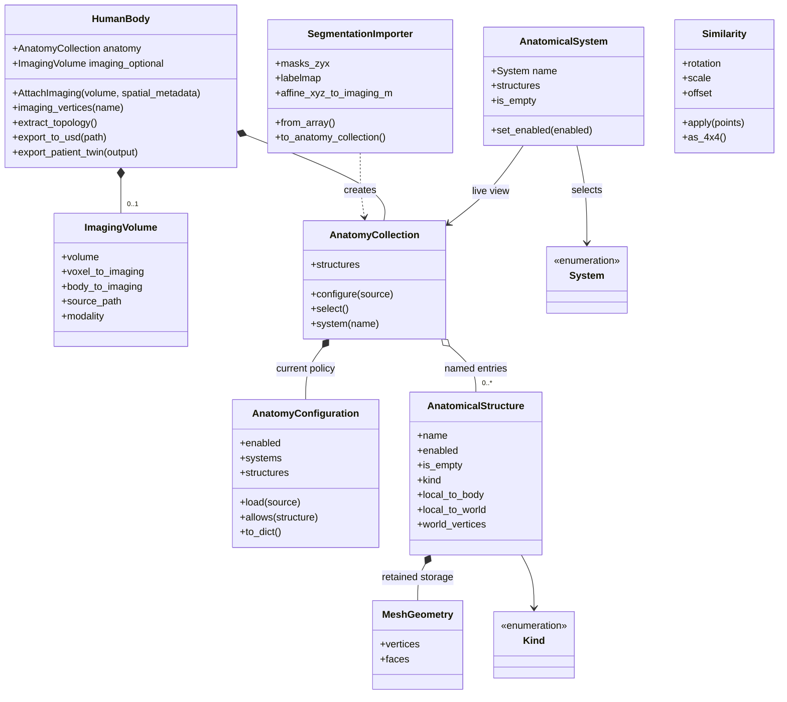

# patient_digital_twin: anatomy, meshes, and imaging

This Python package turns an existing 3D segmentation into a patient model:
named anatomical structures with meshes, optional attached imaging,
and rules for displaying them. `HumanBody` is the application-facing API.
Its anatomy and imaging components retain geometry and spatial metadata.

The core segmentation reader consumes existing masks. Separate importer adapters
can invoke generation or segmentation backends when their runtimes and models
are installed. The package does not infer diagnoses, implement a tissue solver,
or automatically anonymize patient data. It uses the bundled
`patient_digital_twin.imaging_to_mesh` subpackage to extract surfaces. This path returns NumPy
geometry; it does not write USD files.

For installation, full-scan examples, and the wider repository pipeline, see
the [distribution README](../README.md). All commands below run from the
`patient-digital-twin/` directory. Install with `pip install -e '.[usd]'`
(or `pip install .` for masks/meshes only). Meshing is included in the base
package; no separate meshing package or source-path setup is needed.

## How it works

1. **Read masks.** `SegmentationImporter` loads a multi-label NIfTI plus its
   matching label dictionary, a directory of non-overlapping binary masks, or
   an integer NumPy array. Its volume is indexed **Z, Y, X**.
2. **Build anatomy.** The importer normalizes names, uses catalog metadata to
   classify labels, and calls `patient_digital_twin.imaging_to_mesh.mask_to_mesh`.
   Each present structure gets centered local vertices, faces, and a rigid
   placement relative to one shared body origin. The collection retains the
   import registration; optional attached imaging lives on `body.imaging`.
   Absent labels remain metadata with no mesh.
3. **Choose what is enabled.** `AnatomyCollection` applies a YAML policy for
   all anatomy, systems, or individual structures. Disabling exposes an empty
   structure without deleting its retained geometry.
4. **Attach imaging.** Optionally attach a NumPy volume and its spatial metadata
   with `AttachImaging()`.
5. **Extract topology and export.** Store local vessel/airway centerlines, then
   write a USD snapshot or a manifest-based patient bundle. CT and centerlines
   are optional. See the [USD guide](../docs/usd.md).

## Class diagram

Solid diamonds indicate ownership, open diamonds indicate aggregation, solid
arrows indicate references, and dotted arrows indicate use or creation.



`AnatomicalSystem` is a view, not another owner of meshes. A pancreas can
belong to digestive and endocrine systems while remaining one structure.

Not every component is a class: `catalog.py` supplies kinds and name-based
membership; `geometry.py` supplies coordinate math. These helpers keep
`HumanBody` small.

## Use the public API

A metadata-only body does not need the mesh converter:

```python
from patient_digital_twin import AnatomicalStructure, HumanBody, Kind, System

body = HumanBody({
    name: AnatomicalStructure(name, Kind.ORGAN)
    for name in ("liver", "kidney_left")
})
assert body.anatomy.structures["liver"].is_empty
urinary = body.anatomy.system(System.URINARY)
print([item.name for item in urinary.structures])
```

To import actual geometry:

```python
from patient_digital_twin import HumanBody, SegmentationImporter

importer = SegmentationImporter(
    "sample_label.nii.gz",
    "/path/to/matching/label_dict.json",
)
anatomy = importer.to_anatomy_collection()
body = HumanBody(anatomy)
liver = body.anatomy.structures["liver"]
body_surface = liver.body_vertices  # No imaging is attached.
```

Use the label dictionary that produced the image: numeric IDs differ between
segmentation workflows. `strict=False` retains unknown labels as `Kind.UNKNOWN`;
`strict=True` rejects unclassified labels. For image segmentation and mesh-file
imports, use the adapters in `patient_digital_twin.importers`.

### Coordinate contract

All mesh coordinates use **XYZ meters**. The input array alone uses
ZYX ordering. The full voxel-to-imaging affine carries image spacing,
orientation, origin, shear, and reflection into the extracted vertices.

Each structure retains:

- `mesh.vertices`: source vertices in its centered local frame.
- `local_to_body`: its imported rigid placement relative to the shared body origin.
- `local_to_world`: its current rigid display placement.

`body.anatomy.body_to_imaging` retains the import coordinate relationship.
Call `body.AttachImaging(volume_zyx, voxel_to_imaging=affine_m)` to attach
NumPy imaging using that registration, or supply an explicit `body_to_imaging`.
The attached volume and provenance live on `body.imaging`, initially `None`.
The importer chooses the center of the extracted anatomy's bounding box as the
body origin, independent of visibility settings. `body.imaging_vertices(name)`
requires attachment and recovers the original surface in that image frame; `structure.body_vertices` uses the body frame.

Read `structure.world_vertices` for rendering; do not transform them again.
Source vertices remain unchanged during posing. Public geometry properties
return `None` for disabled or unsegmented structures.

### Configure empty structures

```yaml
anatomy:
  enabled: true
  systems:
    digestive: false
    skeletal: true
  structures:
    liver: true
```

```python
body.anatomy.configure("examples/data/nv_ct_high_resolution/anatomy.yaml")
body.anatomy.set_enabled(False)  # All internal geometry becomes empty.
body.anatomy.set_enabled(True)  # Restore previous individual rules.
body.anatomy.set_system_enabled("skeletal", False)
body.anatomy.set_structure_enabled("liver", True)
active = body.anatomy.select(include_empty=False)
```

The master disable wins over everything. Otherwise a structure override wins;
without one, any disabled system makes a shared-system structure empty.
Missing settings default to enabled. Invalid names, ambiguous YAML keys, and
non-boolean values fail before policy changes are committed.

Configuration replacement is explicit: `body.anatomy.configure({})` restores
defaults; individual setters preserve other choices. Load structure-specific
policies after those labels exist.

Disabling does not free mesh memory or skip extraction. Retained geometry and
transforms are unchanged, so re-enabling restores the current placement.
It never fabricates absent meshes.

## Source map and unit tests

All public package classes have direct unit coverage. The internal
`_UniqueKeyLoader` is exercised through public YAML loading. This means class
coverage, not a claim of exhaustive branch coverage or proof of anatomical correctness.

| Classes/component | Source | Tests |
| --- | --- | --- |
| `HumanBody` | [human.py](human.py) | [test_human.py](../tests/test_human.py) |
| `AnatomyCollection`, `AnatomicalSystem` | [anatomy.py](anatomy.py) | [test_anatomy.py](../tests/test_anatomy.py) |
| `AnatomyConfiguration`, YAML loader | [configuration.py](configuration.py) | [test_configuration.py](../tests/test_configuration.py) |
| `Kind`, `System`, `MeshGeometry`, `AnatomicalStructure` | [structures.py](structures.py) | [test_structures.py](../tests/test_structures.py) |
| `Similarity`, rigid/affine helpers | [geometry.py](geometry.py) | [test_geometry.py](../tests/test_geometry.py) |
| `SegmentationImporter` | [importers/_segmentation.py](importers/_segmentation.py) | [test_importer.py](../tests/test_importer.py) |
| Bundled mask meshing | [imaging_to_mesh/mesh.py](imaging_to_mesh/mesh.py) | [test_imaging_to_mesh.py](../tests/test_imaging_to_mesh.py), [test_installation.py](../tests/test_installation.py) |
| Catalog/import functions | [catalog.py](catalog.py) | [test_catalog.py](../tests/test_catalog.py) |
| `ImagingVolume` | [imaging.py](imaging.py) | [test_human.py](../tests/test_human.py) |
| USD and bundle exports | [exporters/](exporters/) | [test_usd.py](../tests/test_usd.py), [test_patient_twin_export.py](../tests/test_patient_twin_export.py) |
| CT orientation / attenuation | [exporters/utils.py](exporters/utils.py) | [test_exporter_utils.py](../tests/test_exporter_utils.py) |
| Physics-demo exports | [exporters/physics_export.py](exporters/physics_export.py) | [test_physics_export.py](../tests/test_physics_export.py) |
| Unified pipeline and backends | [pipeline.py](../examples/pipeline.py), [importers/](importers/) | [test_pipeline.py](../tests/test_pipeline.py), [test_importer_backends.py](../tests/test_importer_backends.py) |

```bash
# Minimal install: optional integration tests are skipped.
uv run --extra dev pytest
```

Run the command from the repository root too to test the aggregate distribution.
The segmentation label-loader unit test uses a controlled mapping fixture
and does not run segmentation. Optional integration tests require their own
USD, topology, or physics dependencies.

## Import migration

Prefer package-level imports, for example
`from patient_digital_twin import HumanBody, SegmentationImporter`.
Math helpers live in `patient_digital_twin.geometry`.

The rigid-only API replaces `classification` with `kind` and removes per-structure
label provenance. `local_to_body` replaces `local_to_imaging`; use the optional
`body.anatomy.body_to_imaging` to recover scan placement.

Importer migration: use `to_anatomy_collection()` and wrap the result with
`HumanBody(anatomy)`. Configure through `body.anatomy`.
Export modules now live under `exporters/`; old
`patient_digital_twin.usd` and `patient_digital_twin.patient_twin` imports are gone.
Load CT into NumPy and call `AttachImaging()` instead of passing `ct_path` to an
exporter. `export_to_usd()` preserves current structure transforms. Patient bundles
use the original imported placement.
