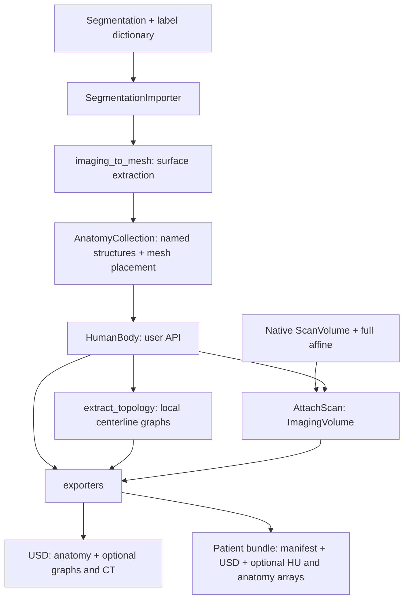

# patient_digital_twin

The Python library behind Patient Digital Twin. Start with the
[quickstart](../README.md) to load a segmentation, extract meshes, optionally add
centerlines and CT, and export the result.

## How the library fits together

## Main entry points

- [SegmentationImporter](importers/_segmentation.py) reads labeled NIfTI,
  binary-mask directories, or NumPy masks. `to_anatomy_collection()` extracts meshes.
- [HumanBody](human.py) owns `anatomy` and optional `imaging`, and exposes
  `extract_topology()`, `AttachScan()`, `AttachImaging()`, `export_to_usd()`, and `export_patient_twin()`.
- [AnatomyCollection](anatomy.py) exposes `structures[name]` and controls visibility.
  Disabling a structure preserves its mesh.
- The optional `nvsegment` and `nvgenerate` extras enable the corresponding
  importers. Model dependencies load only when inference is requested; source
  checkouts and weights are separate. Inference runs in-process unless an
  explicit `python_executable` is provided.
- [__main__.py](__main__.py) provides the NV-Segment / NV-Generate CLI.
- [scan_volume.py](scan_volume.py) reads native NIfTI/DICOM grids and saves or replays
  NumPy + YAML artifacts. The same helper is shipped in sensor-simulation.
- [legacy_ct](legacy_ct/README.md) isolates the temporary skeleton-centerline implementation.

## Coordinates and outputs

Meshes and stored structure centerlines use XYZ meters. `structure.mesh.vertices`
uses the local frame; `structure.body_vertices` includes the original body
placement. `structure.world_vertices` includes the current display placement.

`AttachScan()` retains native values and geometry for export; `AttachImaging()`
remains a lower-level KJI/RAS-meter API. With CT, schema-3 USD and bundle geometry
use the scan physical frame and units. CT and masks preserve source array order.
Simulator world placement is applied downstream.

With attached CT and `vessel_names`, bundle export calculates a navigation graph
from the retained source labels, or rasterizes meshes if labels are unavailable.
See the [export steps](../README.md#4-export) and [USD guide](../docs/usd.md).
