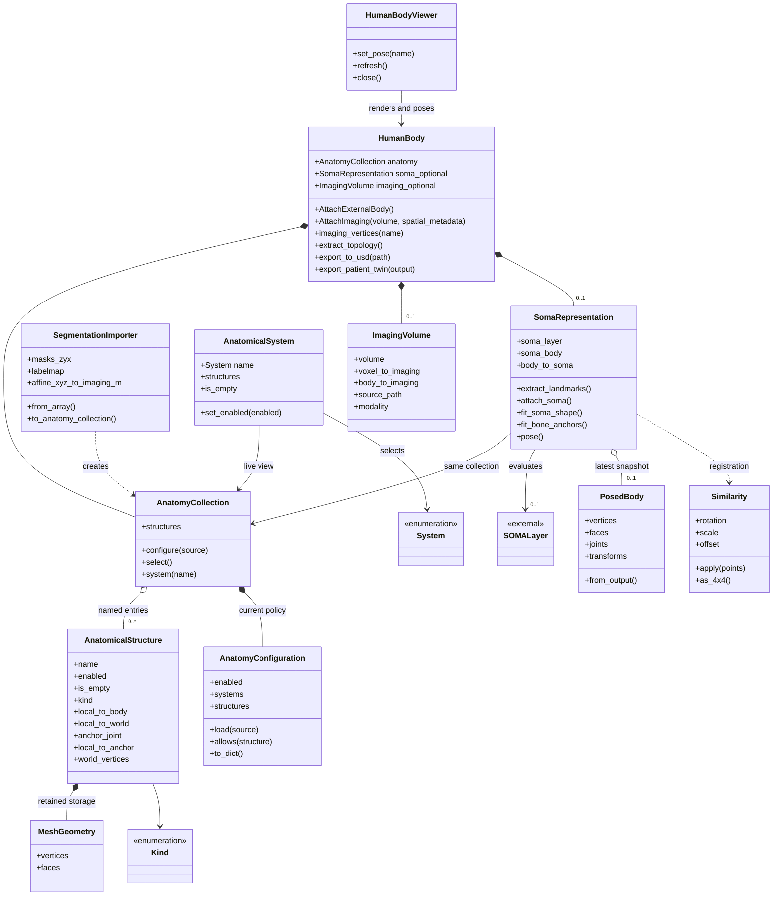

# patient_digital_twin: anatomy, meshes, and an articulated body

This Python package turns an existing 3D segmentation into a patient model:
named anatomical structures with meshes, an optional SOMA-X external body,
and rules for moving and displaying them together. `HumanBody` is the
application-facing API. Its anatomy and SOMA components do the detailed work.

The core segmentation reader consumes existing masks. Separate importer adapters
can invoke generation or segmentation backends when their runtimes and models
are installed. The package does not infer diagnoses, implement a tissue solver,
or automatically anonymize patient data. It uses the bundled
`patient_digital_twin.imaging_to_mesh` subpackage to extract surfaces. This path returns NumPy
geometry; it does not write USD files.

For installation, full-scan examples, and the wider repository pipeline, see
the [distribution README](../README.md). All commands below run from the
`patient-digital-twin/` directory. Install with `pip install -e '.[soma,viewer]'`
(or `pip install .` for masks/meshes only). Meshing is included in the base
package; no separate meshing package or source-path setup is needed.

## How it works

1. **Read masks.** `SegmentationImporter` loads a multi-label NIfTI plus its
   matching label dictionary, a directory of non-overlapping binary masks, or
   an integer NumPy array. Its volume is indexed **Z, Y, X**.
2. **Build anatomy.** The importer normalizes names, uses catalog metadata to
   classify labels, and calls `patient_digital_twin.imaging_to_mesh.mask_to_mesh`.
   Each present structure gets centered local vertices, faces, and a rigid
   placement relative to one shared body origin. The collection retains the
   import registration; optional attached imaging lives on `body.imaging`.
   Absent labels remain metadata with no mesh.
3. **Choose what is enabled.** `AnatomyCollection` applies a YAML policy for
   all anatomy, systems, or individual structures. Disabling exposes an empty
   structure without deleting its retained geometry.
4. **Attach an external body.** `SomaRepresentation` fits/aligns a SOMA-X
   model using measured or estimated landmarks, or an explicit registration.
   It stores joint anchors for the internal meshes.
5. **Pose and inspect.** SOMA evaluation moves the skin and joint frames.
   Every anatomical structure follows a rigid joint transform.
   The viewer renders the skin and enabled internal anatomy.
6. **Export.** Write a USD snapshot or a manifest-based patient bundle. CT, SOMA
   and stored centerlines are optional. See the [USD guide](../docs/usd.md).
7. **Validate.** Containment checks test all enabled mesh vertices and, by
   default, triangle centers against the current skin. Validate every new
   patient and every required pose.

## Class diagram

Solid diamonds indicate ownership, open diamonds indicate aggregation, solid
arrows indicate references, and dotted arrows indicate use or creation.
`SOMALayer` is supplied by the optional SOMA-X dependency;
`HumanBodyViewer` lives in `examples/viewer.py`.



`AnatomicalSystem` is a view, not another owner of meshes. A pancreas can
belong to digestive and endocrine systems while remaining one structure.
After attachment, `body.anatomy.structures` and `body.soma.structures` reference
the same dictionary.

Not every component is a class: `catalog.py` supplies kinds and name-based membership; `geometry.py` supplies coordinate math; `soma_body/geometry.py`
decodes model output and assigns joints; `soma_body/fitting.py` implements skin-shape and rigid bone-offset fitting. These helpers keep `HumanBody` small.

## Use the public API

A metadata-only body does not need SOMA or the mesh converter:

```python
from patient_digital_twin import AnatomicalStructure, HumanBody, Kind, System

body = HumanBody({
    name: AnatomicalStructure(name, Kind.ORGAN)
    for name in ("liver", "kidney_left")
})
assert body.anatomy.structures["liver"].is_empty
urinary = body.anatomy.system(System.URINARY)
print([item.name for item in urinary.structures])
```

To import actual geometry:

```python
from patient_digital_twin import HumanBody, SegmentationImporter

importer = SegmentationImporter(
    "sample_label.nii.gz",
    "/path/to/matching/label_dict.json",
)
anatomy = importer.to_anatomy_collection()
body = HumanBody(anatomy)
liver = body.anatomy.structures["liver"]
body_surface = liver.body_vertices  # No imaging or external body is attached.
```

Use the label dictionary that produced the image: numeric IDs differ between
segmentation workflows. `strict=False` retains unknown labels as `Kind.UNKNOWN`;
`strict=True` rejects unclassified labels. For image segmentation and mesh-file
imports, use the adapters in `patient_digital_twin.importers`.

### Coordinate and pose contract

All mesh and joint coordinates use **XYZ meters**. The input array alone uses
ZYX ordering. The full voxel-to-imaging affine carries image spacing,
orientation, origin, shear, and reflection into the extracted vertices.

Each structure retains:

- `mesh.vertices`: source vertices in its centered local frame.
- `local_to_body`: its imported rigid placement relative to the shared body origin.
- `local_to_anchor`: a fixed rigid offset into a SOMA joint frame.
- `local_to_world`: that joint's current world frame multiplied by the offset.

`body.anatomy.body_to_imaging` retains the import coordinate relationship.
Call `body.AttachImaging(volume_zyx, voxel_to_imaging=affine_m)` to attach
NumPy imaging using that registration, or supply an explicit `body_to_imaging`.
The attached volume and provenance live on `body.imaging`, initially `None`.
The importer chooses the center of the extracted anatomy's bounding box as the
body origin, independent of visibility settings. `body.imaging_vertices(name)`
requires attachment and recovers the original surface in that image frame; `structure.body_vertices` uses the body frame.

Read `structure.world_vertices` for rendering; do not transform them again.
Source vertices remain unchanged during posing. Public geometry properties
return `None` for disabled or unsegmented structures.

Automatic attachment estimates joints from imported humerus/femur meshes and
needs at least three non-collinear shoulder/hip matches in body-frame meters. For a partial scan, supply measured
landmarks or an explicitly registered rigid `body_to_soma` matrix.

```python
body.AttachExternalBody(device="cpu", lod="low")
# Optional fitting order:
# body.soma.fit_soma_shape(required_pose_arrays)
# body.soma.fit_bone_anchors(required_pose_arrays)

parameters = body.soma.soma_parameters  # Copies of fitted scan parameters.
body.soma.pose(parameters["poses"])
report = body.soma.check_containment()
assert all(result["passed"] for result in report.values())
```

`pose()` with no arguments restores the fitted scan pose; it does not retain
the last pose as its new baseline. Direct `body.soma.soma_layer(...)` forward calls
also update anatomy through a hook. For SOMA's two-phase API, pass its output
to `body.soma.update_from_soma(output)`.

`body.soma.soma_configuration` is JSON-ready and reloads through
`body.AttachExternalBody(**saved_configuration)`. It includes fitted joint offsets,
but not segmentation meshes or anatomy YAML settings. Reimport the same masks
before reloading. Matching hints are temporary, and landmarks are cleared after
successful attachment. Posing uses each structure's stored joint and rigid offset.

### Configure empty structures

```yaml
anatomy:
  enabled: true
  systems:
    digestive: false
    skeletal: true
  structures:
    liver: true
```

```python
body.anatomy.configure("examples/data/nv_ct_high_resolution/anatomy.yaml")
body.anatomy.set_enabled(False)  # All internal geometry becomes empty.
body.anatomy.set_enabled(True)  # Restore previous individual rules.
body.anatomy.set_system_enabled("skeletal", False)
body.anatomy.set_structure_enabled("liver", True)
active = body.anatomy.select(include_empty=False)
```

The master disable wins over everything. Otherwise a structure override wins;
without one, any disabled system makes a shared-system structure empty.
Missing settings default to enabled. Invalid names, ambiguous YAML keys, and
non-boolean values fail before policy changes are committed.

Configuration replacement is explicit: `body.anatomy.configure({})` restores
defaults; individual setters preserve other choices. Load structure-specific
policies after those labels exist.

Disabling does not free mesh memory or skip extraction/fitting. Retained
geometry and pose bindings continue to update, so re-enabling returns the
current pose. It neither fabricates absent meshes nor disables the external
SOMA skin.

## Viewer

```bash
uv run --extra soma --extra viewer python examples/viewer.py \
  --segmentation sample_label.nii.gz --labels /path/to/matching/label_dict.json \
  --parameters fitted_soma.json \
  --anatomy-config examples/data/nv_ct_high_resolution/anatomy.yaml
```

Open the localhost URL printed by the viewer. Select named poses, adjust skin
opacity, or check containment. Expand **Visible structures** to check any
combination of structures; use **Select all** or **Clear selection** for bulk
changes. **Show anatomy** temporarily hides anatomy without losing the selection.
Selections persist across pose changes and cannot override disabled anatomy.
For programmatic selection, use `viewer.set_visible_structures(["liver", "kidney_left"])`.

A bundled [high-resolution example](../examples/data/nv_ct_high_resolution/README.md)
includes a 512 × 512 × 768 segmentation, matching labels, a synthetic CT and a
ready-to-run viewer command. Its anatomy is database-derived, not newly synthesized.
After programmatic configuration changes, call `viewer.refresh()`.
Call `viewer.close()` when finished. Add `--validate-only --report report.json`
to run pose checks without starting a browser server.

## Source map and unit tests

All public package classes have direct unit coverage. The internal
`_UniqueKeyLoader` is exercised through public YAML loading; the example viewer
has server/scene tests. This means class coverage, not a claim of exhaustive
branch coverage or proof of anatomical correctness.

| Classes/component | Source | Tests |
| --- | --- | --- |
| `HumanBody` | [human.py](human.py) | [test_human.py](../tests/test_human.py) |
| `AnatomyCollection`, `AnatomicalSystem` | [anatomy.py](anatomy.py) | [test_anatomy.py](../tests/test_anatomy.py) |
| `AnatomyConfiguration`, YAML loader | [configuration.py](configuration.py) | [test_configuration.py](../tests/test_configuration.py) |
| `Kind`, `System`, `MeshGeometry`, `AnatomicalStructure` | [structures.py](structures.py) | [test_structures.py](../tests/test_structures.py) |
| `Similarity`, rigid/affine helpers | [geometry.py](geometry.py) | [test_geometry.py](../tests/test_geometry.py) |
| `PosedBody`, default anchors | [soma_body/geometry.py](soma_body/geometry.py) | [test_soma_geometry.py](../tests/test_soma_geometry.py) |
| `SomaRepresentation` and fitting | [soma_body/representation.py](soma_body/representation.py), [soma_body/fitting.py](soma_body/fitting.py) | [test_soma_representation.py](../tests/test_soma_representation.py), [test_soma.py](../tests/test_soma.py) |
| `SegmentationImporter` | [importers/_segmentation.py](importers/_segmentation.py) | [test_importer.py](../tests/test_importer.py) |
| Bundled mask meshing | [imaging_to_mesh/mesh.py](imaging_to_mesh/mesh.py) | [test_imaging_to_mesh.py](../tests/test_imaging_to_mesh.py), [test_installation.py](../tests/test_installation.py) |
| Catalog/import functions | [catalog.py](catalog.py) | [test_catalog.py](../tests/test_catalog.py) |
| `HumanBodyViewer` | [viewer.py](../examples/viewer.py) | [test_viewer.py](../tests/test_viewer.py) |
| `ImagingVolume` | [imaging.py](imaging.py) | [test_human.py](../tests/test_human.py) |
| USD and bundle exports | [exporters/](exporters/) | [test_usd.py](../tests/test_usd.py), [test_patient_twin_export.py](../tests/test_patient_twin_export.py) |
| CT orientation / attenuation | [exporters/utils.py](exporters/utils.py) | [test_exporter_utils.py](../tests/test_exporter_utils.py) |
| Physics-demo exports | [exporters/physics_export.py](exporters/physics_export.py) | [test_physics_export.py](../tests/test_physics_export.py) |
| Unified pipeline and backends | [pipeline.py](../examples/pipeline.py), [importers/](importers/) | [test_pipeline.py](../tests/test_pipeline.py), [test_importer_backends.py](../tests/test_importer_backends.py) |
| Actual SOMA integration | External model and package pipeline | [test_real_soma.py](../tests/test_real_soma.py) |

```bash
# Minimal install: optional integration tests are skipped.
uv run --extra dev pytest

# SOMA/viewer integration; real SOMA assets must be available.
PATIENT_TWIN_TEST_SOMA=1 uv run --extra dev --extra soma --extra viewer pytest
```

Run the first command from the repository root too to test the aggregate
distribution. The shape-optimization unit test uses a deterministic,
shape-responsive model fixture; it does not substitute for fitting a full
scan with the actual model. The TotalSegmentator label-loader unit test uses
a controlled mapping fixture and does not run segmentation.

Every package class, top-level function, and class method has an in-source
docstring. Use `help(SomaRepresentation.attach_soma)` or follow its reference to
`SomaRepresentation.attach_soma` for the detailed model options.

The [full-scan validation notes](../validation/README.md) describe the separately
tested 109-structure patient and four poses. Containment tests inspect finite
surface samples, not all possible triangle intersections or all possible poses.
Those reports predate the rigid-only refactor. Revalidate your actual
patient/pose combinations with the current implementation.

## Import migration

Prefer package-level imports, for example
`from patient_digital_twin import HumanBody, PosedBody`.
Math helpers now live in `patient_digital_twin.geometry`. Old helper imports
from `human.py` are not all preserved. Likewise, attach models and registration
through `body.AttachExternalBody(layer, body_to_soma=matrix)`, not constructor
keywords on `HumanBody`.

The rigid-only API replaces `classification` with `kind` and removes per-structure
label provenance. `local_to_body` replaces `local_to_imaging`; use the optional
`body.anatomy.body_to_imaging` to recover scan placement. For an old explicit registration,
convert it with `body_to_soma = old_imaging_to_soma @ body.anatomy.body_to_imaging`.
Landmarks passed to `attach_soma` now use body coordinates; transform imaging
landmarks by the inverse of `body.anatomy.body_to_imaging` first. Saved parameter files
from the previous API should be regenerated. Soft-tissue deformation options
have been removed; rigid organs may protrude during articulation, and containment
checks continue to report those failures.

Importer migration: use `to_anatomy_collection()` and wrap the result with
`HumanBody(anatomy)`. Configure through `body.anatomy`, and pose or fit through
`body.soma` after attachment. Export modules now live under `exporters/`; old
`patient_digital_twin.usd` and `patient_digital_twin.patient_twin` imports are gone.
Load CT into NumPy and call `AttachImaging()` instead of passing `ct_path` to an
exporter. `export_to_usd()` defaults to `pose="scan"`; request `"current"` explicitly
for the displayed pose.
